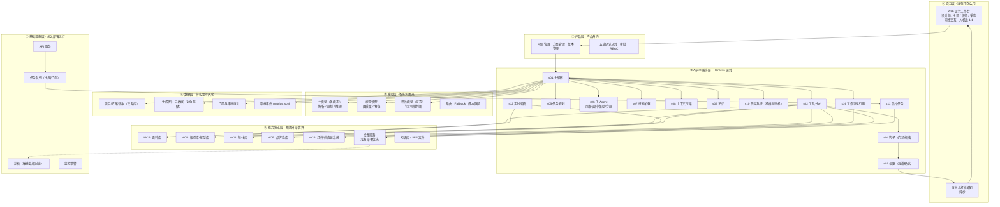

# 鞋服智能设计 Agent · 产品需求文档（PRD）

| 项目 | 内容 |
|---|---|
| 产品名称 | 款式工场（暂定） |
| 英文标识 | `shoe_apparel_design_agent` |
| 文档版本 | v1.0 |
| 文档状态 | 待评审 |
| 适用范围 | V1（设计师工作台 + 打样流程对接） |
| 需求来源 | 用户口述方向：需求解析 / 风格自主规划 / 绘图工具 / 面料库 / 版型库 / 款式生成 / 面料搭配 / 版型迭代 / 对接打样 |

**阅读说明**

- 用户口述方向是硬基线，本文不改写其结论。
- 凡原文未给出、由本文补充的内容，一律标注 `【补充】`，并汇总在 §14 待确认清单。
- 本文按仓库 `BLUEPRINT.md` 规范编写：**§1–§6、§8–§14 是产品需求；§7 是按五步 SOP 推导的 Harness 架构方案。**
- 功能需求（FR）编号可直接用于排期、开发任务拆分与测试用例映射。
- 本文写法对齐仓库既有文档规范（`PRD-创作者AI分身.md`、`out/legal-xiaozhi-plan/PRD-法小智-详细版.md`、`BLUEPRINT.md`）。

---

## 1. 产品概述

### 1.1 一句话定位

把「企划需求 → 风格方向 → 款式图 → 面料搭配 → 版型参数 → 打样技术包」这条目前靠设计师与版师反复沟通的重活，压缩成一条**AI 自主规划、设计师全程掌舵**的流水线。

### 1.2 价值主张

> **不是「会画图的 AI」，而是「画出来能打样、能落地的款式」。**

通用绘图模型能出漂亮效果图，但做不到三件事：**能用库里真实存在的面料、能给出版师认的尺寸表、能直接生成打样单**。本产品真正的门槛不在出图，而在**把创意连接到可采购的物料与可生产的版型**，并强制经过人工确认后才进入打样。

### 1.3 解决的核心痛点

| # | 痛点 | 现状 | 解法 |
|---|---|---|---|
| P1 | 设计师要花大量时间把一句话企划翻译成可执行的设计语言 | 企划会 → 设计师个人理解 → 手绘效果图，方向常跑偏，返工多 | 需求解析为结构化设计简报，风格规划先出「蓝图」再出图，方向可提前校准 |
| P2 | 款式探索成本高，一个方向出不了几张图 | 手绘/找参考/拼图，单方向数小时 | AI 一次生成多风格方向 × 多款式变体，效果图 + 款式图 + 色彩方案成套输出 |
| P3 | 面料选错导致打样返工、成本飙升 | 设计师凭经验选面料，采购时才知无库存/超价/交期不够 | 面料搭配必须从**真实面料库**检索，命中库存、价格、MOQ、交期，并给替代方案 |
| P4 | 版型参数靠版师从零调，反复起样 | 版师口头/表格沟通，尺寸表版本混乱 | 从**版型参数库**检索基样，参数化迭代（改松量/长度），每次迭代留版本 |
| P5 | 打样流程靠邮件与 Excel 传递，信息丢失 | 技术包手工整理，BOM 漏项，样衣评审结论难追溯 | 自动生成 BOM + 尺寸表 + 工艺说明草稿，一键转打样单，评审结论回写 |

### 1.4 产品结构

```
款式工场（shoe_apparel_design_agent）
├── 需求解析        —— 一句话企划 → 结构化设计简报
├── 风格自主规划    —— 生成风格蓝图（灵感/色彩/廓形/关键单品/材料故事）
├── 款式生成        —— 调用绘图工具出效果图 + 平面款式图 + 变体
├── 面料搭配        —— 从真实面料库检索、组合、给替代方案与成本
├── 版型迭代        —— 从版型库取基样，参数化改版，留版本
├── 方案筛选        —— 多方案横向对比、评分、设计师定稿
└── 打样对接        —— 生成技术包 / BOM / 样单，走审批后进打样
```

**共用底座（真正的门槛所在，模型无法绕过）：**

```
物料真实性门禁 · 版型可生产门禁 · 原创性与侵权检查 · 成本与价格带预检 · 打样前人工确认 · 版本追溯
```

### 1.5 明确不做（V1 非目标）

| 不做 | 原因 |
|---|---|
| 代替设计师定稿 | 设计决策权归人；AI 只出候选方案 |
| 代替版师定版 / 出可直接开模的最终版 | 版师签字是责任边界；AI 只出参数草稿 |
| 生成可直接下单大货的最终工艺单（不经人审） | 一旦漏项即造成批量损失 |
| 承诺面料价格、交期、MOQ | 以面料库与供应商回执为准，AI 不背书 |
| 生成明显复刻他人品牌标志性款式的设计 | 侵权红线 |
| 3D 虚拟试穿 / CLO3D 级物理仿真 | 【补充】V2 方向，V1 只到平面图与参数 |
| 自动向打样厂下单 | 必须走审批（FR-60） |

### 1.6 关键差异点（护城河）

| 门禁 | 内容 | 若没有它会怎样 |
|---|---|---|
| **物料真实性门禁** | 面料/辅料/鞋材只能引用库中真实记录；成分、克重、价格、库存、MOQ 一律不得编造 | 退化为又一个「好看但买不到」的绘图玩具 |
| **版型可生产门禁** | 尺寸表必须来自基样库或设计师确认参数；AI 生成值必须标记「待确认」，不得标记为已确认 | 错误尺寸直接下厂，整批样衣报废 |
| **原创性检查** | 生成图与品牌款库做相似度比对，超阈值阻断并给差异化建议 | 产品变成抄袭工具，法务风险不可控 |
| **成本预检** | 自动 BOM 成本对比目标价带，超带即提示 | 方案漂亮但做不出来，浪费后续全部流程 |
| **打样前人工确认** | 对接打样系统前必须设计师/主设审批 | 未经确认的草稿流入供应链，责任不清 |
| **效果图 ≠ 工艺图** | 概念图与技术图分离，各自标注用途与置信度 | 工厂拿效果图开模，尺寸全错 |

---

## 2. 目标用户与场景

### 2.1 用户分层

| 层级 | 用户 | 核心诉求 | V1 是否主要验收人群 |
|---|---|---|---|
| 核心 | 服装设计师 | 快速探索款式与面料组合，出成套设计稿 | ✅ 是 |
| 核心 | 鞋类设计师 | 快速探索鞋面/鞋底/楦型方案 | ✅ 是 |
| 核心 | 设计主设 / 设计总监 | 审风格方向、筛方案、把控成本与调性 | ✅ 是 |
| 重要 | 版师 / 工艺师 | 拿到可用参数草稿，减少从零起版 | ⚠️ 兼顾（确认方） |
| 重要 | 面料/采购 | 面料库维护、替代面料确认、成本核实 | ⚠️ 兼顾（数据方） |
| 次要 | 商品企划 / 买手 | 需求下发与上市节奏把控 | ⚠️ 兼顾（需求方） |
| 次要 | 打样厂 / 供应商 | 接收技术包与样单 | ❌ V1 只到导出/推送，不接供应商端系统 |

### 2.2 用户画像（用于设计决策）

**U1 · 服装设计师（核心）**
- 场景：拿到「女装夏季连衣裙，25–35 岁通勤，吊牌价 499，6 月上市」的企划
- 痛点：要出 5–8 个方向给主设选，全部手绘来不及；选完还要配面料、问采购、等版师
- 成功标准：2 小时内拿到 3 个风格方向 × 各 3 款变体 + 面料搭配 + 成本区间
- 关键要求：**推荐的面料必须是库里真实存在、能查到价格和交期的**

**U2 · 鞋类设计师（核心）**
- 场景：开发一双轻量通勤跑鞋，目标价 399，楦型沿用现有 42 码楦
- 痛点：鞋面材料组合试错成本高，鞋楦参数与帮面样板强耦合，改一处牵动全身
- 成功标准：拿到 3 套鞋面材料方案 + 可复用的楦型参数 + 帮面分片说明
- 关键要求：**楦型参数只能来自楦库，不能凭空生成**

**U3 · 设计主设（核心）**
- 场景：从设计师提交的 9 个方案中定 3 个进打样
- 成功标准：一屏看清每个方案的风格、成本、面料可得性、相似度风险
- 关键要求：**必须能一眼看出「哪些是 AI 编的、哪些是库里有的」**

**U4 · 版师（重要）**
- 场景：收到尺寸表草稿，决定直接改还是重起版
- 成功标准：草稿标注了基样来源与每个改动点
- 关键要求：**未确认参数必须显式标记，不能伪装成已定版**

### 2.3 使用场景清单

| 编号 | 场景分类 | 典型场景 | 主要用户 | 产出 |
|---|---|---|---|---|
| SC-01 | 服装款式开发 | 企划 → 风格方向 → 款式图 → 面料 → 尺寸表 | 服装设计师 | 设计方案集 + 技术包草稿 |
| SC-02 | 鞋款开发 | 场景/价位 → 鞋面+大底方案 → 楦型参数 → 分片 | 鞋设计师 | 设计方案集 + 技术包草稿 |
| SC-03 | 风格方向探索 | 只给主题/情绪，要 AI 自主规划多个风格方向 | 设计师/主设 | 风格蓝图集 |
| SC-04 | 面料搭配与替代 | 指定款式，找可采购面料组合，含替代与成本 | 设计师/采购 | 面料搭配表 + BOM 草稿 |
| SC-05 | 版型迭代 | 在基样上改松量/长度/廓形，比较版本差异 | 设计师/版师 | 版型版本 + 差异表 |
| SC-06 | 方案筛选 | 多方案横向对比，评分排序，定稿 | 主设/总监 | 方案对比表 + 定稿 |
| SC-07 | 打样对接 | 生成技术包/BOM/样单，审批后推送打样 | 设计师/主设 | 技术包 + 样单 |
| SC-08 | 借鉴与规避 | 参照竞品调性但不侵权，输出差异化方案 | 设计师/法务 | 差异说明 + 相似度报告 |

---

## 3. 成功指标

### 3.1 北极星指标

**AI 方案进入打样的比例（方案采纳率）**
= 进入打样环节的方案数 / AI 生成的方案总数

目标：V1 试点 ≥ 30%。
理由：出图数量没有意义。方案被真人设计师选中并愿意花钱打样，才算真正有用。

### 3.2 指标分层

**A. 质量指标（决定产品成立与否）**

| 指标 | 定义 | 目标 |
|---|---|---|
| 面料库命中率 | AI 推荐面料中，在库可查、库存/交期可用的比例 | ≥ 95% |
| 物料信息准确率 | 成分/克重/价格/MOQ 与库中记录一致的比例（抽查） | 100% |
| 版型参数可溯率 | 尺寸表中每个数值都能指回基样库或设计师确认记录 | 100% |
| **打样一次通过率** | 首次打样即被评审通过（或仅需微调）的样衣/样鞋比例 | 相对基线 +15pp |
| 版型返工率 | 因尺寸/松量错误导致的返工比例 | ≤ 10% |
| BOM 完整率 | 生成的 BOM 无漏项（人工复核） | ≥ 98% |
| 相似度拦截准确率 | 判定为「高风险复刻」的方案确实存在侵权风险的比例 | ≥ 90% |
| 成本预估偏差 | 预估 BOM 成本 vs 采购核价偏差 | ≤ 15% |

**B. 体验指标**

| 指标 | 定义 | 目标 |
|---|---|---|
| 需求解析准确率 | 结构化简报与企划原意一致（设计师确认） | ≥ 90% |
| 追问有效率 | 追问补充的信息实际改变了方案的比例 | ≥ 70% |
| 风格方向采纳率 | 至少一个 AI 规划的风格方向被设计师采纳 | ≥ 60% |
| 首图产出版本 | 从提交到第一张可用效果图 | ≤ 60s |
| 设计师时间节省 | 同一企划下，从需求到技术包草稿的耗时对比 | ≥ 50% |

**C. 性能指标**

| 指标 | 目标 | 测量条件 |
|---|---|---|
| 进度反馈首响 | ≤ 2s | 固定简报、固定绘图服务 |
| 单方案完整产出（图+面料+BOM草稿） | ≤ 90s | 3 款变体 × 1 个方向 |
| 版型迭代一轮 | ≤ 30s | 单参数改动重算尺寸表 |

### 3.3 指标采集方式 `【补充】`

| 类别 | 覆盖指标 | 采集方式 | 数据落点 |
|---|---|---|---|
| **A 运行时自动采集** | 面料库命中率、物料信息准确率（比对）、版型参数可溯率、首响耗时、迭代耗时、相似度拦截率 | 代码埋点，方案定稿时写结构化事件 | `data/metrics.jsonl` |
| **B 固定测试集自动比对** | 需求解析准确率、BOM 完整率、成本预估偏差、物料信息一致性 | 固定企划集 + 专家标注；跑批比对 | `data/eval/` |
| **C 人工评审** | 打样一次通过率、版型返工率、风格方向采纳率、方案采纳率、相似度判定准确率 | 打样评审表 + 设计师打分 | `data/eval/review-*.md` |

**重要边界**：以上均为**试点目标**，非已实现效果。打样一次通过率受工厂工艺影响，必须与控制组（人工设计同品类）对比，不得单独宣称。

---

## 4. 版本范围

### 4.1 V1 范围

- 服装 + 鞋两类品类贯通「需求解析 → 风格规划 → 款式生成 → 面料搭配 → 版型参数 → 技术包草稿 → 打样单草稿」
- 面料库、鞋材库、版型/楦型库：**对接现有企业内部数据源**（只读为主，V1 不做在线编辑）
- 绘图：调用外部图像生成工具（文生图 + 图生图 + 线稿上色），V1 不训练专有模型
- 输出：效果图、平面款式图、色彩方案、面料搭配表、尺寸表草稿、BOM 草稿、技术包、样单
- 人工确认：需求简报确认、风格方向确认、面料确认、版型确认、打样审批（五道）
- 版本：方案与版型全版本可追溯

### 4.2 后续扩展

| 能力 | 说明 |
|---|---|
| 3D 虚拟样衣 / CLO3D 对接 | 【补充】V2，可大幅降低打样次数 |
| 专有风格模型微调（品牌风格 LoRA） | 【补充】V2，用品牌历史款式训练风格一致性 |
| 面料供应商端在线报价与打样申请 | 【补充】V2 |
| 趋势数据接入（WGSN / POP 等） | 【补充】V2，需采购数据源授权 |
| 自动排料与用料优化 | 【补充】V2 |
| 跨季品牌风格记忆 | 【补充】依赖账户体系与长期记忆 |

---

## 5. 信息架构与页面结构

### 5.1 站点结构

```
设计工作台 (/workbench)
├── 顶部：品类切换（服装 | 鞋）+ 当前方案名 + 阶段进度条
├── 左栏：需求简报区（可编辑的结构化卡）
├── 中栏：方案画布（分页：风格蓝图 | 效果图 | 款式图 | 面料搭配 | 版型参数 | 技术包）
└── 右栏：依据区（面料来源 / 版型来源 / 成本 / 相似度 / 风险提示）

方案库 (/projects)
└── 项目列表 → 方案列表 → 版本历史

打样 (/sampling)
└── 待审批样单 | 打样中 | 评审反馈 | 封样归档

资产库 (/libraries)  ← V1 只读
├── 面料库 / 鞋材库
├── 版型库 / 楦型库
└── 品牌款库（用于相似度检查）
```

### 5.2 中栏画布分区（核心交互面）

| 分区 | 内容 | 是否可编辑 |
|---|---|---|
| 风格蓝图 | 主题、灵感关键词、色彩故事、廓形、关键单品、材料故事 | ✅ 可编辑（改后需重生成） |
| 效果图 | 概念效果图（多方向 × 多变体） | ❌ 只读（重新生成代替编辑） |
| 款式图 | 平面款式图 / 工艺图（正背侧） | ✅ 可标注修改点 |
| 面料搭配 | 主料/辅料/撞料组合 + 替代方案 + 成本 | ✅ 设计师可换料（只能换库内料） |
| 版型参数 | 尺寸表 + 松量 + 基样来源 + 改动点 | ✅ 设计师可改（改后标记「已确认」） |
| 技术包 | BOM + 尺寸表 + 工艺说明 + 色卡 + 洗标 | ✅ 可编辑 |

### 5.3 页面状态清单

| 状态 | 表现 |
|---|---|
| 空态 | 示例企划一句话，一键填入 |
| 解析中 | ≤2s 出现阶段提示，显示正在解析哪些要素 |
| 待确认 | 简报 / 风格 / 面料 / 版型各有独立确认按钮，未确认不进入下一阶段 |
| 生成中 | 显示第 N 个方案 / 共 M 个，已完成 X 张图 |
| 成功 | 方案 + 依据 + 成本 + 相似度 + 风险提示 |
| 库内无匹配 | 明确标注「库内无匹配」，给出放宽条件建议，**绝不用近似值冒充** |
| 相似度过高 | 阻断 + 高亮相似部位 + 差异化建议 |
| 绘图失败 | 不展示半成品图，给原因 + [重试] |
| 接口失败 | 明确区分「接口失败」与「库内无匹配」 |

---

## 6. 功能需求

### 6.0 需求总览

| 模块 | FR 编号 | 功能 |
|---|---|---|
| 通用 | FR-01 ~ FR-08 | 入口、需求解析、要素抽取、必要追问、简报确认、进度反馈、结果编辑、依据展示 |
| 风格规划 | FR-10 ~ FR-13 | 风格蓝图、色彩企划、廓形/楦型方向、方向自主扩展 |
| 款式生成 | FR-20 ~ FR-24 | 绘图工具调用、效果图、平面款式图、变体生成、重绘与局部改 |
| 面料搭配 | FR-30 ~ FR-35 | 面料/鞋材检索、搭配组合、替代方案、成本估算、色卡匹配 |
| 版型迭代 | FR-40 ~ FR-45 | 基样检索、参数化改版、松量/长度调整、版本对比、可生产校验 |
| 方案筛选 | FR-50 ~ FR-52 | 方案对比、评分排序、定稿锁定 |
| 打样对接 | FR-60 ~ FR-64 | 技术包生成、BOM、样单、审批门禁、评审反馈回写 |
| 横切 | FR-70 ~ FR-75 | 物料真实性门禁、版型可生产门禁、原创性检查、成本预检、异常降级、版本追溯 |
| 数据 | FR-80 ~ FR-82 | 项目数据、权限、日志脱敏 |

---

### 6.1 通用功能

#### FR-01 入口与品类路由

**描述**：用户进入工作台，选择品类（服装 / 鞋），进入对应流程。

**规则**
1. 品类决定后续所有库的检索范围（面料库 vs 鞋材库，版型库 vs 楦型库）。
2. 品类判定优先用户显式选择；未选择时从企划内容推断，且**结果可见可改**。
3. 切换品类不丢失已填企划内容，但需重新解析。

**验收标准**
- AC-01-1：未选品类时，「开始解析」可用，但解析结果标注「品类为系统推断」。
- AC-01-2：鞋类企划不会检索到服装面料库。

---

#### FR-02 需求解析（业务需求 → 结构化设计简报）

**描述**：把企划文本（会议记录、商品需求单、一句话）解析为结构化设计简报。

**简报必填字段**

| 字段 | 服装 | 鞋 |
|---|---|---|
| 品类 | 品类/子品类（连衣裙/风衣/西裤…） | 品类（跑鞋/板鞋/靴/正装鞋…） |
| 目标人群 | 年龄/性别/风格偏好 | 同 |
| 使用场景 | 通勤/运动/度假/正式 | 跑步/通勤/徒步/球场 |
| 价格带 | 吊牌价 / 成本上限 | 同 |
| 上市时间 | 波段/月份 | 同 |
| 风格关键词 | 主题/情绪/参考品牌调性 | 同 |
| 关键约束 | 面料限制、工艺限制、渠道限制 | 楦型限制、模具限制 |

**规则**
1. 解析结果以**可编辑卡片**展示，每字段标注来源（用户明确说明 / 系统推断）。
2. **不猜测**未提到的信息，未提到即标「未提供」。
3. 价格带缺失时必须在追问阶段补，因为成本预检依赖它。
4. 解析完成必须经 FR-05 确认。

**验收标准**
- AC-02-1：解析准确率 ≥90%（§3.3 B 类）。
- AC-02-2：系统推断字段在 UI 上有视觉区分。
- AC-02-3：价格带未提供时，界面提示「缺少价格带，成本预检将不可用」。

---

#### FR-03 要素抽取

**描述**：抽取影响风格规划与库检索的关键要素。

**要素清单**
- 风格要素：主题、情绪、参考调性、色彩倾向、廓形倾向
- 约束要素：价格带、成本上限、面料限制（如「不用真皮」「需环保认证」）、工艺限制
- 时间要素：上市波段、打样交期
- 品类要素：具体单品清单（如「连衣裙 + 薄外套」）

**规则**
1. 抽取结果可编辑，作为风格规划与检索的输入。
2. 用户修改要素后，提示「条件已变化，需重新规划」。
3. 未识别要素显示「未识别」，不留空、不填默认值。

**验收标准**
- AC-03-1：要素卡展示「要素 / 值 / 来源」。
- AC-03-2：修改要素后旧方案标记为「基于旧条件」，不自动删除但需重新生成。

---

#### FR-04 必要追问

**描述**：简报不足以支撑有效规划时追问。

**规则**
1. **上限 3 轮**。
2. 只追问影响方案与成本的信息：价格带、场景、上市时间、面料/工艺红线。
3. 每轮问题属同一主题。
4. 到上限仍不足时：明确标注假设与缺口，基于假设出方案，**不假装信息完整**。
5. 界面显示「第 N 轮 / 最多 3 轮」。

**验收标准**
- AC-04-1：第 3 轮后不再追问，转为「基于以下假设生成」。
- AC-04-2：追问有效率 ≥70%（§3.3 C 类）。
- AC-04-3：用户可跳过，跳过后缺口显式标注。

---

#### FR-05 简报确认（第一道人工确认）

**描述**：进入风格规划前，设计师确认简报。

**规则**
1. 未确认不进入下一步，[确认并继续] 按钮为禁用态并说明原因。
2. 确认动作记录操作人与时间戳。
3. 确认后简报冻结为 v1，后续修改产生新版本。

**验收标准**
- AC-05-1：未确认时风格规划按钮不可用。
- AC-05-2：确认记录可在版本历史中查到。

---

#### FR-06 进度反馈

**描述**：长耗时任务必须给进度。

**规则**
1. 首响 ≤2s。
2. 阶段命名示例：`解析简报 → 规划风格方向 → 生成效果图 → 检索面料 → 搭配与成本 → 生成款式图 → 校验版型 → 生成技术包`。
3. 生成 N 个方案时按方案粒度显示进度，允许部分方案先到。
4. 任一方案失败不阻塞其他方案。

**验收标准**
- AC-06-1：提交后 2s 内出现阶段提示。
- AC-06-2：9 个方案中 1 个失败时，其余 8 个可正常查看，失败项标红可重试。

---

#### FR-07 结果可编辑

**描述**：除生成图外，结构化结果均可编辑。

**规则**
1. 可编辑：简报、风格蓝图、面料选择、尺寸表、BOM、工艺说明。
2. 不可编辑（只读）：生成的效果图/款式图、库中原始物料记录。
3. 用户编辑内容标记「设计师修改」，与 AI 生成内容区分。
4. **设计师手动填写的物料信息必须标注「人工录入，未经验证」**，不视同库内数据。

**验收标准**
- AC-07-1：效果图区域无输入框。
- AC-07-2：导出技术包中保留「AI 生成 / 设计师修改 / 人工录入」三类标记。
- AC-07-3：人工录入的物料在打样审批时高亮提示。

---

#### FR-08 依据展示（AI 生成 vs 库内数据分离）

**描述**：所有来自库的数据必须展示来源，与 AI 生成内容明确分离。

**规则**
1. 每条面料/鞋材展示：物料编号、名称、来源（库/人工录入）、库存、价格、MOQ、交期、供应商、更新时间。
2. 每条版型参数展示：基样编号、来源（库/设计师）、版本、确认状态。
3. 视觉区分三类：**库内数据**（引用块）、**AI 生成**（正文）、**AI 推断**（标注「推断」）。
4. 点击任一物料可查看库中原始记录。

**验收标准**
- AC-08-1：面料行可点击展开原始库记录。
- AC-08-2：AI 推断的数值必须有「推断」角标。
- AC-08-3：不存在无来源的物料行。

---

### 6.2 风格自主规划模块（FR-10 ~ FR-13）

> 这是「自主规划」的落点：设计师只给企划，AI 自主产出可执行的设计方向，但方向必须先以**蓝图**形式呈现并被确认，再进入出图。

#### FR-10 风格蓝图生成

**描述**：基于简报自主规划 1–5 个风格方向，每个方向输出一份结构化蓝图。

**蓝图结构**

```
风格方向名（如「静奢通勤」「都市户外」「复古运动」）
├── 主题陈述（1–2 句）
├── 灵感关键词（5–8 个）
├── 色彩故事（主色/辅色/点缀色，含色卡号）
├── 廓形方向（服装：H/A/X/O；鞋：楦型/鞋头/鞋底厚度）
├── 关键单品/部件清单
├── 材料故事（面料方向/鞋材方向，需可落库）
├── 目标情绪与场景匹配说明
└── 为什么这个方向适合本次企划（依据说明）
```

**规则**
1. 每个方向必须给出**选择理由**，不能只给名字。
2. 方向之间必须**有明确差异**（色彩/廓形/材料至少两项不同），不得是同一方向的微调。
3. 色彩必须给可核对的色卡号（Pantone TCX / COLORO 等），不得只写「蓝色」。
4. 方向数量默认 3 个 `【补充】`，可配置 1–5。
5. 蓝图必须经设计师确认（或编辑后确认）才进入出图。

**验收标准**
- AC-10-1：3 个方向两两之间至少两项维度不同（自动校验）。
- AC-10-2：色彩方案均含色卡号。
- AC-10-3：未确认蓝图时，[生成效果图] 为禁用态。

---

#### FR-11 色彩企划

**描述**：为每个方向生成可执行的色彩方案。

**规则**
1. 输出：主色（占比）、辅色、点缀色，含色卡号与 RGB/HEX。
2. 色彩需与品类、季节、场景匹配（如夏季通勤 vs 冬季户外）。
3. 若面料库支持按色卡检索，**色彩方案需检索库内是否有对应色卡的面料**，无则标注。
4. 色彩不得与品牌现有主推款冲突（若品牌款库可用）`【补充】`。

**验收标准**
- AC-11-1：色彩方案含色卡号且可复制。
- AC-11-2：库内无对应色时标注「库内无此色卡面料」。

---

#### FR-12 廓形与结构方向

**描述**：给出廓形/结构层面的设计方向。

**服装侧**
- 廓形（H/A/X/O/T）、长度、领型、袖型、下摆、开合方式、结构线位置

**鞋侧**
- 楦型方向（圆头/尖头/方头、楦宽）、鞋头高度、中底厚度与落差、大底纹路方向、鞋帮高度、系带方式

**规则**
1. 结构方向必须**可映射到版型库/楦型库中的现有基样**，或明确指出「需新开版」。
2. 无对应基样时，标注「需版师新起版」，不得伪造参数。
3. 结构描述避免模糊词（如「合适的领型」）。

**验收标准**
- AC-12-1：每个方向关联至少一个版型库基样编号，或标注「需新起版」。
- AC-12-2：不出现「合适」「适当」等无数值表述作为关键结构定义。

---

#### FR-13 方向自主扩展与收敛

**描述**：支持 AI 自主扩展方向，也支持按设计师反馈收敛。

**规则**
1. 设计师可对某方向给反馈（「更宽松些」「降低运动感」），AI 在该方向上生成变体，**不重开全部方向**。
2. 设计师可要求「再来 3 个完全不同的方向」。
3. 收敛操作（保留 A、B，淘汰 C）记录到方案历史，被淘汰方案不删除、不参与后续输出。
4. 方向数量上限受配置控制，避免无限生成 `【补充】`。

**验收标准**
- AC-13-1：反馈后仅目标方向更新，其他方向内容不变。
- AC-13-2：被淘汰方向不出现在技术包与对比表中。

---

### 6.3 款式生成模块（FR-20 ~ FR-24）

#### FR-20 绘图工具调用

**描述**：调用外部图像生成工具生成设计图。

**工具能力要求**

| 能力 | 用途 | 必填入参 | 必需出参 |
|---|---|---|---|
| 文生图 | 从蓝图文案生成概念效果图 | 提示词、风格参考、画幅、数量 | 图片 URL、seed、模型版本、耗时 |
| 图生图 | 基于某方案生成变体 | 底图、变化强度、提示词 | 同上 |
| 线稿上色 | 款式图 → 效果图 | 线稿图、配色方案 | 同上 |
| 局部重绘 | 只改袖型/鞋底等局部 | 底图、蒙版、局部提示词 | 同上 |
| 背景移除 / 抠图 | 出图交付 | 图片 | 透明底 PNG |

**规则**
1. 提示词由 AI 基于蓝图结构化生成，**提示词对用户可见可编辑**。
2. 每次生成记录 seed 与工具版本，保证可复现。
3. 生成结果必须经过原创性检查（FR-72）后才标记为「可用方案」。
4. **工具失败不得展示半成品图**。
5. 生成图默认标注「AI 生成概念图，非最终工艺图」。

**验收标准**
- AC-20-1：提示词可见可编辑，编辑后重生成生效。
- AC-20-2：同 seed + 同提示词可复现同图（允许服务端有微小差异时说明）。
- AC-20-3：所有生成图带「AI 生成」水印/角标。

---

#### FR-21 概念效果图

**描述**：输出成套概念效果图。

**规则**
1. 每个确认方向输出多款变体（默认 3 款 `【补充】`）。
2. 图必须体现蓝图中的色彩与廓形，**不得与蓝图不符**。
3. 服装：正/背视图；鞋：侧视/俯视/45° 视图（至少侧视）。
4. 图旁标注：方向名、变体编号、用色、主要材料方向。

**验收标准**
- AC-21-1：生成图色彩与蓝图色彩方案的匹配度为人工可核（主色一致）。
- AC-21-2：鞋类方案至少含侧视图。

---

#### FR-22 平面款式图 / 工艺图

**描述**：输出可用于打样的平面款式图。

**规则**
1. 平面款式图必须包含：结构线、分割线、缝线、开口、辅料位置（拉链/纽扣/织带）、尺寸标注位。
2. **平面款式图与效果图必须成对存在**，不可只给效果图。
3. 明确标注「工艺图需版师/工艺师复核」。
4. 平面图风格统一（同一套线条规范），便于车间识别。

**验收标准**
- AC-22-1：每个进入打样的方案必须同时有平面款式图。
- AC-22-2：平面图含辅料位置标注。
- AC-22-3：技术包中平面图带「待工艺复核」标记。

---

#### FR-23 变体生成

**描述**：在保持风格一致的前提下生成变体。

**规则**
1. 变体维度：色彩、长度、领型/鞋头、细节（口袋/织带/logo 位）。
2. 变体必须**保持方向一致性**（不跑偏成另一风格）。
3. 变体数量可配置，避免无限生成。
4. 每个变体独立走面料搭配与成本预检。

**验收标准**
- AC-23-1：同一方向的变体在风格上可被识别为同族（人工评审）。
- AC-23-2：变体数量超上限时给出提示而非静默截断。

---

#### FR-24 局部重绘与人工标注

**描述**：设计师对不满意的局部要求重绘。

**规则**
1. 设计师框选区域 + 文字说明 → 局部重绘。
2. 重绘不得改变未框选区域。
3. 支持在图上加标注（箭头/文字）作为沟通语言，标注不进最终交付图。
4. 重绘历史保留（可回退到上一版）。

**验收标准**
- AC-24-1：局部重绘后未框选区域像素级一致 `【补充】`（允许因压缩有微小差异需说明）。
- AC-24-2：标注可导出为沟通稿，可从交付稿中隐藏。

---

### 6.4 面料搭配模块（FR-30 ~ FR-35）

#### FR-30 面料/鞋材检索

**描述**：从真实面料库/鞋材库检索可用物料。

**检索条件**

| 服装面料库字段 | 鞋材库字段 |
|---|---|
| 物料编号、名称、成分、组织结构、克重(g/m²)、幅宽、纱支、弹性、透气、手感 | 物料编号、名称、类别（皮革/网布/飞织/TPU/中底/大底）、厚度、密度、硬度(邵氏)、耐磨、防滑 |
| 色牢度、缩水率、起球、价格、MOQ、交期、供应商、库存、色卡号、环保认证 | 拉伸、耐折、色牢度、价格、MOQ、交期、供应商、库存、环保认证 |
| 适用品类、季节 | 适用鞋类、适用部位 |

**规则**
1. **检索结果只能来自库**。库中无匹配时明确标注「库内无匹配」，**不得用近似物料冒充或编造成分克重**。
2. 展示结果必须含：库存、价格、MOQ、交期、供应商、数据更新时间。
3. 库存为 0 或交期超出上市时间时，标注为「不可用（原因）」。
4. 支持按色彩方案检索同色系/可染色物料。

**验收标准**
- AC-30-1：面料库命中率 ≥95%（§3.3 A 类）。
- AC-30-2：任一面料行字段与库记录逐字段一致（抽查 100%）。
- AC-30-3：库内无匹配时输出「库内无匹配」+ 放宽条件建议，不得输出编造物料。

---

#### FR-31 面料搭配组合

**描述**：为每款设计生成面辅料搭配方案。

**输出**
- 主料、辅料（里布/衬布/拉链/纽扣/罗纹/织带）、撞料、缝纫线
- 每个物料的用量估算（含损耗率）
- 组合说明（为什么这样搭）

**规则**
1. 搭配必须满足基础工艺可行性（如：弹性要求 → 需含弹力成分；户外 → 需防水/防风）。
2. 每个位置必须指定具体库内物料，不接受「类似面料」这种描述。
3. 主料缺货时自动给替代方案（见 FR-33）。
4. 搭配需与色彩方案一致（色卡号可核对）。

**验收标准**
- AC-31-1：搭配表中每个物料都有库内编号。
- AC-31-2：弹力/防水等工艺要求与所选物料属性一致（自动校验，不符则告警）。

---

#### FR-32 成本估算

**描述**：基于库内价格与用量估算 BOM 成本。

**规则**
1. 成本 = Σ(物料单价 × 用量 × (1 + 损耗率)) + 加工费估值。
2. 加工费无库内数据时，必须标注为「估算值，需采购核价」。
3. 与目标价格带对比，输出「在带内 / 超带 X%」。
4. 成本估算必须注明基于的物料价格与更新时间，**不承诺最终成本**。

**验收标准**
- AC-32-1：成本明细可展开到每个物料。
- AC-32-2：超价格带时高亮提示并给降本建议（换料/减工序）。
- AC-32-3：加工费估算显著标注。

---

#### FR-33 替代方案

**描述**：主料不可用时给替代物料。

**规则**
1. 替代逻辑：属性相似（成分/克重/性能）+ 价格与交期可接受 + 有色卡匹配。
2. 每个替代必须标注**差异点**（如「克重 +10g，手感更挺」）。
3. 替代方案需采购或设计师确认，不自动替换。
4. 无合适替代时明确说明，不强行推荐。

**验收标准**
- AC-33-1：替代方案带差异说明与价格差。
- AC-33-2：不出现「无差异」的替代（若真无差异则说明是同款不同批次）。

---

#### FR-34 拼色与撞料建议

**描述**：基于色彩方案给拼色/撞料建议。

**规则**
1. 给出拼色分区（如：身片主色、袖侧撞色、领口点缀）。
2. 每个分区对应具体面料与色卡号。
3. 拼色块数不宜过多（默认 ≤4 块 `【补充】`，影响工艺成本）。

**验收标准**
- AC-34-1：拼色方案含分区示意与物料对应。
- AC-34-2：拼色块数超阈值时提示工艺成本上升。

---

#### FR-35 面料确认（第三道人工确认）

**描述**：设计师/采购确认最终面料组合。

**规则**
1. 未确认面料不进入版型与打样阶段。
2. 确认记录操作人与时间。
3. 采购确认后标记「已核价」。
4. 若使用非库内人工录入物料，必须由采购确认后才可进打样。

**验收标准**
- AC-35-1：面料未确认时，[生成技术包] 禁用。
- AC-35-2：人工录入物料未经采购确认时，打样审批被阻断。

---

### 6.5 版型迭代模块（FR-40 ~ FR-45）

#### FR-40 基样/楦型检索

**描述**：从版型库/楦型库检索可用基样。

**版型库字段（服装）**

| 字段 | 说明 |
|---|---|
| 基样编号 | 主键 |
| 品类 | 连衣裙/衬衫/西裤… |
| 版型风格 | 修身/合体/宽松/廓形 |
| 尺码体系 | 国标 GB/T 1335 / 品牌自有 |
| 部位尺寸 | 衣长、胸围、肩宽、袖长、袖口、下摆、领围、腰围、臀围、前浪、后浪、裤长、脚口 |
| 松量 | 各部位松量 |
| 原样方法 | 原型法/立体裁剪 |
| 适用面料 | 克重/弹性范围 |
| 版本 | 版本号 + 修改记录 |

**楦型库字段（鞋）**

| 字段 | 说明 |
|---|---|
| 楦型编号 | 主键 |
| 楦型 | 圆头/尖头/方头、肥瘦型 |
| 尺码体系 | 欧码/美码/中国码 |
| 楦长 / 前掌宽 / 腰窝宽 / 后跟宽 | 关键宽度 |
| 跖围 / 跗围 | 关键围度 |
| 前翘 / 底弧 / 后跟弧 | 曲面参数 |
| 跟高 | 跟高 |
| 放码规则 | 围度/长度放码 |
| 适用鞋类 | 跑鞋/板鞋/靴… |
| 版本 | 版本号 + 修改记录 |

**规则**
1. **参数只能来自库**；库中无匹配品类时标注「需版师新起版」。
2. 检索需与设计方向匹配（廓形/楦型方向 → 基样）。
3. 展示基样的适用面料范围，若所选面料超出范围则告警。

**验收标准**
- AC-40-1：每个方案关联的基样编号可在库中查到。
- AC-40-2：无匹配时明确标注「需新起版」，不生成假参数。
- AC-40-3：面料超出基样适用范围时告警。

---

#### FR-41 参数化改版

**描述**：在基样上按设计意图调整参数。

**可调参数**
- 服装：各部位尺寸、松量、廓形参数、结构线位置
- 鞋：楦宽/围度微调、中底厚度、跟高、帮面高度

**规则**
1. 每个参数改动显示：原值 → 新值 → 变化量。
2. **AI 建议的改动必须标注「AI 建议，待版师确认」**，不得标记为已定版。
3. 参数改动需给出合理性检查（如松量过小导致无法活动，围度不满足穿脱）。
4. 超出基样合理范围时告警，需版师确认。

**验收标准**
- AC-41-1：尺寸表中 AI 建议值带「待确认」标记。
- AC-41-2：松量/围度不合理时给出告警。
- AC-41-3：所有改动可追溯到设计意图（哪句需求导致这个改动）。

---

#### FR-42 尺寸表生成

**描述**：输出完整尺寸表（尺码 × 部位）。

**规则**
1. 尺寸表必须包含：部位、基样值、本款值、变化量、公差、备注、数据来源。
2. 多尺码时给放码规则（从基样库取，不自行编造）。
3. **每个数值必须可溯**：来自基样库 / 设计师输入 / AI 建议。
4. 尺寸表导出为标准格式（Excel），列名与车间习惯一致。

**验收标准**
- AC-42-1：版型参数可溯率 100%（§3.3 A 类）。
- AC-42-2：AI 建议数值与库内数值在导出文件中有不同标记。
- AC-42-3：公差列非空（无数据时标注「默认公差」）。

---

#### FR-43 版型版本对比

**描述**：对比两次迭代的差异。

**规则**
1. 以表格 + 高亮展示：哪些部位变了、变了多少、由哪次反馈导致。
2. 支持回退到任一历史版本。
3. 版本需带备注（设计师填写的改动原因）。
4. 打样单必须绑定具体版本号，避免版本错乱。

**验收标准**
- AC-43-1：版本对比表可导出。
- AC-43-2：打样单上的版型版本号与当时定稿版本一致。

---

#### FR-44 可生产性校验

**描述**：在进入打样前校验版型与工艺可行性。

**校验项**
- 尺寸合理性（松量、围度、比例）
- 面料与版型匹配（弹性面料配的版型是否留了合适松量）
- 工艺可行性（拼色块数、分割线数量、辅料可得性）
- 鞋：楦型与帮面匹配、底弧与跟高匹配、围度是否够穿脱

**规则**
1. 校验结果分「通过 / 告警 / 阻断」三级。
2. 阻断项必须由版师/工艺师处理后才能进打样。
3. 告警项可由设计师确认后继续，但记录在案。

**验收标准**
- AC-44-1：存在阻断项时，[提交打样] 不可用。
- AC-44-2：告警项在打样单上有明确记录。

---

#### FR-45 版型确认（第四道人工确认）

**描述**：版师确认尺寸表。

**规则**
1. 版师确认前，尺寸表标记为「草稿」。
2. 版师可修改数值，修改后标记为「版师确认值」。
3. 确认后尺寸表冻结为打样依据版本。
4. 未确认不得进打样。

**验收标准**
- AC-45-1：未确认时打样单生成被阻断。
- AC-45-2：版师修改记录可查。

---

### 6.6 方案筛选模块（FR-50 ~ FR-52）

#### FR-50 方案横向对比

**描述**：多方案横向对比。

**对比维度**
- 风格方向匹配度、色彩方案、廓形/楦型、面料组合、BOM 成本 vs 价格带、面料可得性（库存/交期）、相似度风险、版型可用性（现成基样 or 需新起版）

**规则**
1. 对比表所有数值可溯源。
2. 成本、可得性、风险用颜色区分（绿/黄/红）。
3. 明确标注「需新起版」的方案（成本更高、周期更长）。

**验收标准**
- AC-50-1：对比表行数 = 方案数。
- AC-50-2：被淘汰方案不出现在对比表中。

---

#### FR-51 方案评分与排序

**描述**：给方案打分辅助决策，**但不代替决策**。

**规则**
1. 评分维度权重可配置 `【补充】`。
2. 评分必须给**可解释理由**，不能只给数字。
3. 明确标注「评分为辅助参考，不构成设计决策」。
4. 不得出现「AI 推荐此方案为最佳」这种替人决策的表述。

**验收标准**
- AC-51-1：每个评分维度有理由说明。
- AC-51-2：界面含「辅助参考」声明。

---

#### FR-52 定稿锁定

**描述**：设计师/主设定稿，锁定进入打样的方案。

**规则**
1. 定稿需指定方案 + 版型版本 + 面料组合。
2. 定稿后该组合冻结，修改需新建版本。
3. 未定稿方案不进入技术包。
4. 定稿记录操作人与时间。

**验收标准**
- AC-52-1：定稿后方案内容不可直接编辑，需「基于此版本新建」。
- AC-52-2：定稿记录可查。

---

### 6.7 打样对接模块（FR-60 ~ FR-64）

#### FR-60 技术包生成

**描述**：生成可交付打样的技术包（Tech Pack）。

**技术包结构**

```
1. 方案封面（品类、风格方向、版本号、日期、设计师）
2. 设计图（效果图 + 平面款式图，正/背/侧）
3. 色彩方案（色卡号 + 实物色卡建议）
4. BOM（物料编号、名称、规格、用量、损耗、单价、供应商、MOQ）
5. 尺寸表（部位 × 尺码，含基样来源与确认状态）
6. 工艺说明（缝制工艺、特殊工艺、注意事项）
7. 辅料与唛头（主唛/洗水唛/吊牌/包装）
8. 面料/鞋材实样需求清单（需寄样确认的物料）
9. 风险与未决项（告警项、待确认项）
10. 附件说明
```

**规则**
1. 技术包必须区分「已确认」与「待确认」字段。
2. 未通过 FR-44 可生产性校验的方案不得生成技术包。
3. 技术包导出格式：PDF + Excel（BOM 与尺寸表）。
4. 技术包中明确标注「AI 生成草稿，需设计师/版师/工艺复核」。

**验收标准**
- AC-60-1：BOM 完整率 ≥98%（§3.3 B 类）。
- AC-60-2：技术包含「待确认项」清单且非空时无法提交打样。
- AC-60-3：导出文件不含未确认的 AI 建议值被误标为确认值。

---

#### FR-61 BOM 生成

**描述**：生成物料清单。

**规则**
1. 每条 BOM 含：物料编号、名称、规格、颜色/色卡、用量、损耗率、单价、金额、供应商、MOQ、交期。
2. 用量估算需说明计算方法（排版估算/经验值）。
3. 人工录入物料在 BOM 中高亮。
4. 汇总总成本与目标价对比。

**验收标准**
- AC-61-1：BOM 每行有来源标记。
- AC-61-2：成本预估偏差 ≤15%（§3.3 B 类）。

---

#### FR-62 样单生成

**描述**：生成打样申请单。

**样单字段**
- 样单号、关联方案与版本、打样类型（开发样/推销样/确认样/产前样）、数量、尺码、期望交期、打样厂、寄样地址、特殊要求

**规则**
1. 样单必须绑定定稿方案的版本号（FR-52）。
2. 样单生成前必须通过全部人工确认与可生产性校验。
3. 样单需人工审批后才推送（FR-63）。
4. 样单中的交期由设计/商品填写，AI 不承诺交期。

**验收标准**
- AC-62-1：样单含方案版本号。
- AC-62-2：未审批的样单状态为「草稿」。

---

#### FR-63 打样前审批（第五道人工确认）

**描述**：对接打样系统前的最终审批。

**规则**
1. 审批人：设计主设 / 设计总监（可配置）。
2. 审批前系统自动跑一遍门禁检查（FR-70~FR-73），任一阻断项未解决则不可审批。
3. 审批动作记录：审批人、时间、审批意见、附件。
4. 审批通过后才可推送至打样系统/供应商。
5. **AI 不得自动审批**。

**验收标准**
- AC-63-1：存在未解决阻断项时，[审批通过] 为禁用态并列出原因。
- AC-63-2：审批记录不可删除。
- AC-63-3：无审批时无法推送样单。

---

#### FR-64 评审反馈回写

**描述**：打样完成后收集评审结论并回写系统。

**规则**
1. 记录：样衣/样鞋评审结果（通过 / 修改 / 否决）、修改意见、照片、责任环节。
2. 修改意见可一键转为新的版型迭代或面料替换任务。
3. 反馈数据用于计算「打样一次通过率」。
4. 反馈需与样单、方案、版本关联，可追溯。

**验收标准**
- AC-64-1：评审结论可关联到具体版本。
- AC-64-2：反馈可生成新的迭代任务。
- AC-64-3：打样一次通过率可按品类/设计师统计。

---

### 6.8 横切功能

#### FR-70 物料真实性门禁（核心）

**描述**：所有进入输出的物料信息必须来自库记录。

**校验规则（缺一不可）**

| # | 规则 | 失败后果 |
|---|---|---|
| 1 | 物料编号在库中存在 | 拦截 |
| 2 | 成分、克重、规格、颜色与库记录逐字段一致 | 拦截 |
| 3 | 价格、MOQ、交期来自库且有更新时间戳 | 拦截 |
| 4 | 非库内物料必须标记「人工录入」并经采购确认 | 未确认则拦截 |
| 5 | 库存为 0 或交期超上市时间需标记为不可用 | 标记并告警 |
| 6 | 不允许出现没有物料编号的物料行 | 拦截 |

**降级规则**
- 库内无匹配 → 输出「库内无匹配」+ 放宽条件建议 + 允许设计师人工录入（标记未验证）。
- 不得用「类似物料」「市场常见面料」等描述替代具体物料。

**验收标准**
- AC-70-1：物料信息准确率 100%（抽查）。
- AC-70-2：无编号的物料行无法进入技术包。
- AC-70-3：`面料库命中率 ≥95%` 由 §3.3 A 类采集。

---

#### FR-71 版型可生产门禁（核心）

**描述**：所有进入打样的尺寸必须可溯源且已确认。

**校验规则**

| # | 规则 | 失败后果 |
|---|---|---|
| 1 | 每个尺寸值有来源（基样库 / 设计师 / AI 建议） | 拦截 |
| 2 | AI 建议值必须经版师确认后才可进打样 | 未确认则拦截 |
| 3 | 面料属性与版型松量匹配 | 不匹配则告警/阻断 |
| 4 | 鞋：楦型与帮面、跟高与底弧匹配 | 不匹配则阻断 |
| 5 | 放码规则来自库 | 缺失则阻断 |
| 6 | 尺寸表绑定了具体版本号 | 未绑定则拦截 |

**验收标准**
- AC-71-1：版型参数可溯率 100%。
- AC-71-2：未确认的 AI 建议值无法进入技术包。
- AC-71-3：阻断项在 UI 中明确列出且不可跳过。

---

#### FR-72 原创性与侵权检查

**描述**：生成方案与品牌款库做相似度比对。

**规则**
1. 检测维度：整体轮廓、色彩组合、标志性元素（如特定鞋底纹路、logo 位置、标志性口袋/织带）。
2. 相似度分三级：低（放行）/ 中（提示 + 差异化建议）/ 高（阻断）。
3. 高风险方案必须给出**具体差异修改建议**，而非只说「有风险」。
4. 用户明确要求「复刻某品牌某款」时，拒绝生成并说明原因。
5. 品牌款库范围与阈值由管理员配置 `【补充】`。
6. 输出附「原创性声明」：方案为参考性设计，商用前需法务复核。

**验收标准**
- AC-72-1：高风险方案无法进入技术包。
- AC-72-2：相似度报告可导出。
- AC-72-3：要求复刻品牌款的输入被拒绝并给出合规提示。
- AC-72-4：相似度拦截准确率 ≥90%（§3.3 C 类）。

---

#### FR-73 成本与价格带预检

**描述**：自动校验 BOM 成本是否符合目标价格带。

**规则**
1. 成本 = 物料成本 + 加工费估算 + 损耗。
2. 与价格带对比，超带则高亮并给降本建议。
3. 加工费无数据时标注估算，不承诺。
4. 成本预检结果进入方案对比表。

**验收标准**
- AC-73-1：超带方案在对比表中标红。
- AC-73-2：降本建议必须落到具体物料或工序。

---

#### FR-74 异常与降级处理

**描述**：区分不同失败情形，给不同文案。

| 状态 | 触发条件 | 输出文案要点 | 是否可重试 |
|---|---|---|---|
| 库内无匹配 | 检索返回空 | 「库内无匹配」+ 放宽条件建议 + 允许人工录入 | 可（改条件） |
| 结果不足 | 命中数低于方案需求 | 说明不足原因，给更少但更可靠的方案 | 可 |
| 绘图失败 | 绘图工具报错 | 「本次未生成图片」+ 原因 + [重试]，**不展示半成品** | 可 |
| 版型库缺基样 | 无对应品类 | 「需版师新起版」，不给假参数 | 需人工 |
| 相似度过高 | 相似度超阈值 | 阻断 + 差异化建议 | 可（改设计） |
| 接口失败 | 库/绘图/打样系统调用失败 | 「接口失败」+ [重试]，**不得表述为库内无匹配** | 可 |
| 打样系统不可用 | 推送失败 | 保留样单为草稿，不产生假「已提交」状态 | 可 |

**铁律**
1. 不得将接口失败解释为库内无匹配。
2. 不得用模拟/示例数据冒充库内真实物料与版型。
3. 不得编造物料成分、克重、价格、库存、交期、MOQ。
4. 不得编造版型尺寸与放码规则。
5. 不得把 AI 建议标记为已确认。

**验收标准**
- AC-74-1：六类失败情形分别给出对应文案。
- AC-74-2：接口失败时界面对应状态并可重试。
- AC-74-3：打样推送失败不产生假成功状态。

---

#### FR-75 版本追溯

**描述**：全链路版本可追溯。

**规则**
1. 方案版本：简报版本、风格蓝图版本、设计方案版本、版型版本、技术包版本。
2. 每次人工确认产生记录（操作人、时间、内容）。
3. 打样单绑定当时所有版本号。
4. 评审反馈关联到具体版本。
5. 支持从打样单反查完整设计链路。

**验收标准**
- AC-75-1：任一打样单可反查全部上游版本。
- AC-75-2：版本记录不可删除（只可追加）。

---

### 6.9 数据与隐私

#### FR-80 项目数据

- 项目、方案、版本持久化存储（V1 需要，与法小智的临时会话不同，因为打样周期长）。
- 生成图存储于对象存储，保留生成参数（seed/提示词/模型版本）。
- 提供项目归档与恢复。

**验收标准**：AC-80-1 项目重启后数据完整；AC-80-2 生成图元数据可查。

#### FR-81 权限模型

| 角色 | 权限 |
|---|---|
| 设计师 | 创建项目、生成方案、编辑简报与蓝图、选料、发起打样 |
| 主设/总监 | 设计师权限 + 审批打样 + 淘汰方案 |
| 版师 | 查看方案、编辑与确认尺寸表 |
| 面料/采购 | 维护面料库、核价、确认替代面料 |
| 管理员 | 配置门禁阈值、品牌款库、角色权限 |

**验收标准**：AC-81-1 版师无法审批打样；AC-81-2 设计师无法修改面料库原始记录。

#### FR-82 日志脱敏与商业机密

- 日志不得包含成本价、供应商报价、未上市款式关键信息。
- 面料供应商数据仅授权角色可见。
- 未上市方案对外不可见，导出文件带水印与追溯码。
- 调用第三方绘图/模型服务时，需明确哪些数据出境，未上市款式默认不上传或使用私有部署 `【补充】`。

**验收标准**：AC-82-1 日志抽样无价格与供应商信息；AC-82-2 导出文件含追溯码。

---

## 7. Harness 推导（从 PRD 到可落地载具）

> 本章按 `BLUEPRINT.md` 的**五步 SOP** 推导。核心恒等式：
>
> ```
> Agent  = 模型（智能，已训练好） + Harness（载具，你构建的代码）
> Harness = 工具 + 知识 + 观察 + 行动接口 + 权限
> ```
>
> **模型是驾驶者，Harness 是载具。** 本产品真正要构建的不是「更会画图的模型」，而是下面这套**载具**。
>
> **交付纪律**：本章 = Step 4 的架构方案。按 `BLUEPRINT.md` 第七节，**方案确认后才进入 Step 5 代码生成**，方案未确认不写产品代码。

---

### 7.1 Step 1：需求拆解 —— 从 PRD 提取硬事实

**先回答蓝图的 8 个问题。答不上来的就是风险点。**

| # | 问题 | 本产品答案 | 对应章节 |
|---|---|---|---|
| 1 | 要达成什么？ | 把「企划 → 风格 → 款式 → 面料 → 版型 → 打样技术包」压缩为 AI 自主规划、人掌舵的流水线。做成标准：方案采纳率 ≥30%、打样一次通过率 +15pp | §1、§3 |
| 2 | 给谁用？ | 设计师（高频，同步）/ 主设（审批，异步）/ 版师（确认，半同步）/ 采购（核价，异步）。**人机比约 1:1**（一名设计师配一个 agent 会话） | §2.1 |
| 3 | 一次完整交付长什么样？ | 企划文本 → 结构化简报 → N 个风格蓝图 → 效果图+平面款式图 → 面料搭配+BOM → 版型参数+尺寸表 → 技术包 → 样单 → 评审反馈 | §8.1 |
| 4 | 需要什么外部动作？ | 绘图服务、面料库、鞋材库、版型库、楦型库、品牌款库、打样/供应链系统、LLM | §10.1 |
| 5 | 领域知识在哪？ | 品类设计规范、面料/鞋材属性映射、版型/楦型与放码规则、色彩体系、打样规范、六大门禁规则 | §7.2 知识 |
| 6 | 什么绝对不能做？ | 编造物料与版型数据、AI 自动审批打样、生成复刻品牌款、产生假成功状态、未上市款式数据出境 | §13.3 |
| 7 | 失败怎么办？ | 七类降级：库内无匹配 / 结果不足 / 绘图失败 / 版型缺基样 / 相似度超限 / 接口失败 / 打样系统不可用 | §6.8 FR-74 |
| 8 | 怎么算成功？ | 北极星「方案采纳率」+ 质量指标（面料命中率、版型可溯率、打样一次通过率、BOM 完整率） | §3 |

**硬事实表（Step 1 产出）**

| 维度 | 硬事实 | 是否需标「待确认」 |
|---|---|---|
| 目标 | 缩短企划→技术包周期；提升方案采纳与打样一次通过率 | 否（已量化为 §3） |
| 用户 | 设计师 / 主设 / 版师 / 采购，四种角色四种权限 | 否 |
| 核心闭环 | 企划 → 五道人工确认 → 技术包 → 样单 → 反馈回写 | 否 |
| 交付物 | 设计图、BOM、尺寸表、技术包、样单（**不是聊天答复**） | 否 |
| 边界 | 不定稿、不定版、不审批、不复刻、不承诺成本交期 | 否 |
| 约束 | 首响 ≤2s；单方案 ≤90s；未上市款式数据不出境；出图成本需限额 | 否 |
| 数据源形态 | 面料库/版型库是自建还是对接 PLM/ERP | **待确认**（§14 #1） |
| 绘图部署形态 | 第三方 API vs 私有部署 | **待确认**（§14 #2） |
| 相似度阈值 | 数值未标定 | **待确认**（§14 #4） |

---

### 7.2 Step 2：领域建模 —— 把 PRD 映射到 Harness 五要素

> 一张五要素清单 = 产品的「领域骨架」。这是本章最关键的一张表。

#### ① 工具 Tools（交付物需要什么外部动作？）

| 工具域 | 具体工具 | 为什么在 Harness 而不在模型里 |
|---|---|---|
| 绘图 | `generate_concept_image` / `generate_flat_sketch` / `image_to_variant` / `inpaint_region` / `remove_background` | 出图是外部生成服务调用，有成本、有副作用、需幂等与重试 |
| 物料库检索 | `search_fabric` / `get_fabric` / `search_footwear_material` / `get_footwear_material` | 真实性门禁的物理基础：**只有库返回才可信** |
| 版型库检索 | `search_pattern_block` / `get_pattern_block` / `search_last` / `get_last` | 版型可生产门禁的物理基础 |
| 校验 | `check_similarity` / `scan_material_gate` / `scan_pattern_gate` / `check_producibility` / `estimate_cost` | 门禁必须由代码执行，模型无法绕过（§1.6） |
| 打样 | `create_tech_pack` / `create_sample_order` / `push_sample_order` / `get_sample_status` / `write_review_feedback` | 破坏性外部动作，需审批后放行 |
| 资产 | `save_scheme` / `lock_version` / `export_files` | 版本追溯（§6.8 FR-75） |
| 知识 | `load_skill` | 领域知识按需注入，不前置塞满上下文 |

#### ② 知识 Knowledge（领域专长从哪来？）

| 知识类别 | 内容 | 形态 |
|---|---|---|
| 品类设计规范 | 服装各品类结构规范、鞋类各部位规范 | Skill（s07） |
| 物料属性知识 | 成分→性能→工艺可行性映射（弹性/防水/耐磨/克重） | Skill + 库 schema |
| 版型/楦型知识 | 尺码体系、松量规则、放码规则、楦型曲面关系 | Skill + 库 schema |
| 色彩体系 | Pantone TCX / COLORO 色卡与配色规则 | 数据文件 |
| 品牌风格指南 | 品牌调性、禁用元素、Logo 规范 | Skill（可配置） |
| 打样规范 | 样单字段、打样类型、评审标准、封样流程 | Skill |
| **门禁规则** | 物料真实性 6 条、版型可生产 6 条、相似度分级、成本带 | **代码内规则（非提示词）** |

> **关键原则**：知识可以放进提示词或 Skill 供模型参考；**门禁规则必须写进代码**。模型的「自觉」不是门禁，`if` 判断才是。

#### ③ 观察 Observation（如何确认动作产生了预期效果？）

| 观察点 | 来源 | 用途 |
|---|---|---|
| 门禁扫描结果 | `scan_*_gate` 返回 pass/warn/block | 决定能否进入下一阶段 |
| 相似度报告 | `check_similarity` | 决定方案是否可用（FR-72） |
| 成本对比 | `estimate_cost` | 与价格带比对，超带告警 |
| 库存/交期状态 | 物料库返回 | 判定物料可用性 |
| 可生产性校验 | `check_producibility` | 阻断项必须版师处理 |
| 打样评审反馈 | 打样系统回传 | 触发迭代；计算打样一次通过率 |
| 工具调用轨迹 | 每次调用日志 | 可观测性 + 未来微调原料 |
| 人工确认记录 | 五道确认动作 | 审计与版本追溯 |

#### ④ 行动 Action（这些动作以什么形式执行？）

| 行动 | 形式 | 是否需人工确认 |
|---|---|---|
| 出图 / 出款式图 | 绘图服务 API → UI 画布 | 概念图不需；进技术包需 |
| 出简报 / 蓝图 | 模型生成 → UI 可编辑卡 | 需（确认①②） |
| 选料 | 库检索 → UI 搭配表 | 需（确认③） |
| 改版 | 库取基样 → 参数计算 → 尺寸表 | 需（确认④） |
| 生成技术包 | 模板渲染 → PDF/Excel | 需（可生产性校验通过） |
| 推送样单 | 打样系统 API | 需（确认⑤审批） |
| 回写反馈 | 打样系统 API | 否（记录性质） |

#### ⑤ 权限 Permissions（哪些动作需要审批？哪些数据不能碰？）

| 权限层 | 机制 | 对应章节 |
|---|---|---|
| 五道人工确认 | 简报 / 风格 / 面料 / 版型 / 打样审批，缺一不可 | §13.1 |
| 角色 RBAC | 设计师 / 主设 / 版师 / 采购 / 管理员 | §6.9 FR-81 |
| 硬红线 | 不编造、不自动审批、不复刻、不假成功 | §13.3 |
| 数据边界 | 未上市款式与供应商价格不出境、日志脱敏 | §6.9 FR-82 |
| 信任边界 | 库数据 = 可信；人工录入 = 未验证；AI 建议 = 待确认 | §7.4.2 来源标记 |

---

### 7.3 Step 3：组件选型（查架构决策映射表）

> 选型原则来自 `BLUEPRINT.md`：**从最少组件起步，宁可少选。每个组件都要回答「没有它产品会怎样」。**

**选型结论**

| 组件 | 选 | 触发的 PRD 特征 | 没有它会怎样 |
|---|---|---|---|
| **s01 Agent Loop** | ✅ 基础 | 需要多步解析→规划→调用→观察 | 没有 agent，只剩固定表单 |
| **s02 工具系统** | ✅ 必选 | 需调用绘图 + 三库 + 打样系统 | 无法触达真实物料与版型，退化为画图玩具 |
| **s03 权限系统** | ✅ 必选 | 打样是破坏性且昂贵的外部操作 | 未审批样单直接下厂，责任不清、成本失控 |
| **s04 钩子系统** | ✅ 必选 | 需在工具前后做门禁扫描与导出前校验 | 门禁无处挂载，只能靠提示词「求模型自觉」 |
| **s05 任务规划** | ✅ 必选 | 多方向 × 多变体 × 多阶段，需进度可见 | 长任务黑盒，设计师不知道跑到哪一步 |
| **s06 子 Agent** | ✅ 需要 | 风格规划 / 面料搭配 / 版型迭代 / 合规检查上下文互相污染 | 出图噪声挤爆上下文，面料与版型推理质量下降 |
| **s07 技能加载** | ✅ 必选 | 品类规范与打样规范体量庞大 | 规范全量塞进提示词，成本高且稀释注意力 |
| **s08 上下文压缩** | ✅ 需要 | 单项目 3 方向 × 3 变体 × 多版本，会话极长 | 上下文溢出，早期简报与红线被挤掉 |
| **s09 记忆系统** | ✅ 需要 | 需跨项目记住品牌风格与常用面料 | 每次从零开始，风格不连贯 |
| **s10 任务系统** | ✅ 必选 | 打样周期以周计，必须断点续跑 | 重启即丢状态，样单版本错乱 |
| **s11 后台任务** | ✅ 需要 | 批量出图与门禁扫描耗时长 | 阻塞主循环，设计师干等 |
| **s12 定时调度** | ✅ 需要 | 面料库/库存/趋势需周期性同步 | 库存与价格过期，门禁基于陈旧数据 |
| **s13 Agent 团队** | ⚠️ V2 | 多设计师并行、需隔离工作区 | V1 不需要：单人单项目串行即可，过早引入复杂度 |
| **s14 MCP 插件** | ✅ 必选 | 面料库/版型库/打样系统均为外部系统 | 每个库写死一套适配代码，无法扩展与替换 |
| **s15 集成 Harness** | ✅ 必选 | 上述机制需协同到单一循环 | 各机制各自为政，提示词与状态不同步 |
| **s16 工作流运行时** | ✅ 需要 | 打样对接（D1–D7）编排形态固定 | 用自然语言驱动确定性流程，易漏步骤 |
| **s17 目标闭环** | ⚠️ 慎用 | 「门禁是否全通过」可自动判断 | **「设计何时算完成」不能交给评估器**，必须由五道人工确认判定 |

**刻意放弃的组件（以及为什么）**

| 放弃 | 原因 |
|---|---|
| s13 Agent 团队（V1） | 单设计师单项目串行为主，团队协作带来 worktree/邮箱/协议开销，收益不足 |
| s17 目标闭环用于「设计完成判定」 | 设计定稿是人的决策权（§13.1）。评估器只能判「门禁通过没」，不能判「好不好看」 |
| 提示词形式的「门禁」 | 门禁必须是代码（§7.2 知识原则），提示词只能辅助表达 |

**选型到实现的映射**

| 组件 | 参考实现 | 在本产品的落点 |
|---|---|---|
| s01 Agent Loop | `s01_agent_loop` | 解析→规划→调工具→观察→再规划的主循环 |
| s02 工具系统 | `s02_tool_use` | 绘图 / 三库 / 校验 / 打样 四类工具分派 |
| s03 权限系统 | `s03_permission` | 五道人工确认 + 打样推送放行 |
| s04 钩子系统 | `s04_hooks` | PreToolUse 挂门禁扫描；导出前校验 |
| s05 任务规划 | `s05_todo_write` | 多方向 × 多变体任务清单 |
| s06 子 Agent | `s06_subagent` | 风格规划 / 面料搭配 / 版型迭代 / 合规检查 |
| s07 技能加载 | `s07_skill_loading` | 品类设计规范、打样规范按需加载 |
| s08 上下文压缩 | `s08_context_compact` | 图片以引用形式入上下文，先裁工具结果 |
| s09 记忆系统 | `s09_memory` | 品牌风格、常用面料、历史评审偏好 |
| s10 任务系统 | `s10_task_system` | 打样流程 D1–D7 状态机持久化 |
| s11 后台任务 | `s11_background_tasks` | 批量出图、跑门禁不阻塞 |
| s12 定时调度 | `s12_cron_scheduler` | 面料库/库存同步、趋势更新 |
| s13 Agent 团队 | `s13_agent_teams` | V2：多设计师并行工作区 |
| s14 MCP 插件 | `s14_mcp_plugin` | 三个库 + 打样系统以 MCP server 接入 |
| s15 集成 Harness | `s15_integrated_harness` | 单一循环 + 动态重建系统提示词 |
| s16 工作流运行时 | `s16_workflow_runtime` | 打样对接固定编排 + journal 续跑 |
| s17 目标闭环 | `s17_goal_loop` | 仅用于「门禁全通过」的机械判断 |

---

### 7.4 Step 4：架构设计

#### 7.4.1 分层架构图（7 层 + 数据流）

> 铁律：必须产出标准化 7 层分层架构图，不得只画随意的数据流图。



**贯穿各层的一条数据流**（以服装企划为例）：

```
设计师在①提交企划
  → ②建项目、初始化版本
  → ③主循环解析（s01）→ ④主模型产出结构化简报
  → ③追问（≤3轮）→ ②★确认①
  → ③子 Agent 风格规划（s06+s07 加载品类规范）
  → ④产出 N 个风格蓝图 → ②★确认②
  → ③调 ⑤绘图服务出图 → ④视觉模型校验图质量
  → ③s04 钩子调用 ⑤品牌款库 check_similarity
      ├─ 高风险 → ③阻断 + 差异化建议 → 回到出图
      └─ 通过 → 继续
  → ③调 ⑤面料库 search_fabric → ④搭配推理 → ③estimate_cost
  → ②★确认③（设计师+采购）
  → ③调 ⑤版型库 search_pattern_block → 参数化改版
  → ③check_producibility ── 阻断 → 版师处理
  → ②★确认④（版师）→ ②定稿锁定
  → ③生成技术包 → ③s16 工作流跑 D1–D7
  → ②★确认⑤（主设审批）
  → ③④⑤推送打样系统 → ⑥落审计与指标
  → ⑦打样系统反馈回写 → ③触发新一轮迭代
```

#### 7.4.2 工具清单（名称 / 输入 / 输出 / 副作用 / 权限 / 归属层）

| 工具 | 输入 | 输出 | 副作用 | 权限要求 | 归属层 |
|---|---|---|---|---|---|
| `parse_brief` | 企划文本、品类 | 结构化简报 + 缺失字段 | 无 | 设计师 | ③ |
| `search_fabric` | 品类、属性范围、色卡、价上限、库存要求 | 物料完整字段 + 更新时间 | 只读 | 全员 | ⑤ |
| `search_footwear_material` | 鞋材类别、性能要求 | 同上 | 只读 | 全员 | ⑤ |
| `search_pattern_block` | 品类、廓形、尺码体系 | 基样各部位、松量、放码规则 | 只读 | 按项目授权 | ⑤ |
| `search_last` | 鞋类、楦型、肥瘦型 | 楦长/宽度/围度/曲面参数 | 只读 | 按项目授权 | ⑤ |
| `generate_concept_image` | 提示词、参考、画幅、数量 | 图 URL、seed、模型版本 | **计费、外部调用** | 设计师 | ⑤ |
| `generate_flat_sketch` | 结构参数、款式描述 | 平面款式图 | 计费 | 设计师 | ⑤ |
| `inpaint_region` | 底图、蒙版、局部提示词 | 新图 | 计费 | 设计师 | ⑤ |
| `check_similarity` | 图片、款库范围 | 分级、命中参考、差异化建议 | 只读 | 系统内部 | ⑤ |
| `scan_material_gate` | 方案 BOM | pass/warn/block + 明细 | 只读 | 系统内部 | ③(s04) |
| `scan_pattern_gate` | 尺寸表 + 基样 | pass/warn/block + 明细 | 只读 | 系统内部 | ③(s04) |
| `check_producibility` | 版型 + 面料 + 工艺 | 三级结论 + 责任角色 | 只读 | 系统内部 | ③ |
| `estimate_cost` | BOM + 价格带 | 成本明细 + 超带比例 | 只读 | 设计师以上 | ③ |
| `load_skill` | 技能名 | 技能正文 | 无 | 系统内部 | ③(s07) |
| `create_tech_pack` | 定稿方案 + 版本锁 | PDF + Excel | 落盘 | 设计师 | ③ |
| `create_sample_order` | 技术包 + 样单字段 | 样单草稿 | 落库 | 设计师 | ③ |
| `push_sample_order` | 样单 + 审批令牌 | 样单号 / 错误码 | **破坏性外部动作** | **仅审批通过** | ⑤ |
| `get_sample_status` | 样单号 | 状态 + 评审结论 | 只读 | 主设/设计师 | ⑤ |
| `write_review_feedback` | 样单号 + 评审结论 | 反馈记录 | 落库 | 版师/主设 | ③ |
| `save_scheme` / `lock_version` | 方案 + 版本 | 版本号 | 落库 | 设计师 | ③ |

#### 7.4.3 系统提示词草案

```text
# 身份
你是「款式工场」的设计辅助 Agent，服务于鞋服设计团队。
你的职责是把企划翻译为可打样的设计方案，而不是替设计师做决定。

# 铁律（违反即任务失败）
1. 物料信息只能来自面料库/鞋材库返回结果。库中没有就说「库内无匹配」，
   绝不编造成分、克重、价格、库存、MOQ、交期。
2. 版型参数只能来自版型库/楦型库或设计师/版师的输入。
   你给出的任何数值都必须标记为「AI 建议，待版师确认」。
3. 你不得代替任何人做审批。五道确认（简报/风格/面料/版型/打样）由人完成。
4. 不得生成明显复刻他人品牌标志性设计的方案。
5. 不得把「接口失败」说成「库内无匹配」。
6. 概念效果图不是工艺图，二者必须同时产出，且各自标注用途。

# 工作方式
- 先规划后执行：接到企划先产出结构化简报并请人确认，再规划风格方向。
- 风格方向必须先以「蓝图」形式呈现（主题/色彩色卡/廓形/材料故事/选择理由），
  经确认后才出图。方向之间至少两项维度不同。
- 出图前明确提示词，出图后必须过原创性检查。
- 选料必须逐位指定库内物料编号，不接受「类似面料」这类描述。
- 每个尺寸值标注来源：基样库 / 设计师输入 / AI 建议。

# 工具使用
- 查物料用 search_fabric / search_footwear_material；查版型用 search_pattern_block / search_last。
- 出图用 generate_concept_image；局部修改用 inpaint_region；
  平面款式图用 generate_flat_sketch，不得用概念图代替。
- 任何方案进入技术包前必须调用 scan_material_gate、scan_pattern_gate、check_similarity。
- 推送打样只能调用 push_sample_order，且必须持有审批令牌。

# 知识目录（按需加载，不要一次性全部展开）
- apparel-design-spec：服装品类结构规范
- footwear-design-spec：鞋类部位与楦型规范
- material-matching：面料属性与工艺可行性
- pattern-grading：松量、放码与尺码体系
- sampling-spec：打样类型、样单字段、评审标准

# 降级
- 库内无匹配 → 说明 + 放宽条件建议 + 允许人工录入（标记未验证）
- 绘图失败 → 不展示半成品，说明原因并重试
- 版型缺基样 → 明确说「需版师新起版」，不给假参数
- 接口失败 → 明确说明是接口问题，并给重试入口
```

#### 7.4.4 上下文与记忆策略

| 范围 | 策略 | 对应组件 |
|---|---|---|
| 会话内（单项目） | 图片**只以 ID + URL 引用**入上下文，不嵌入像素；工具结果先裁剪再入上下文 | s08 |
| 会话内（多方案） | 每个风格方向由子 Agent 独立上下文，只回传「蓝图 + 图 ID + 结论」 | s06 |
| 跨会话（记忆） | 品牌风格偏好、常用面料、历史评审常见问题 | s09 |
| 权威信息 | 简报 v1、五道确认记录、门禁规则**永不被压缩** | s08/s10 |
| 知识注入 | Skill 目录先行，正文按需 `load_skill` | s07 |
| 任务状态 | 打样状态机持久化到磁盘，断点续跑 | s10/s16 |

**记忆写入规则**（防止污染）

| 写入 | 不写入 |
|---|---|
| 品牌风格关键词、常用面料编号、尺码体系偏好 | 单次项目的临时草稿、被淘汰方案 |
| 历史打样评审的高频问题类型 | 供应商报价、成本价（敏感，§6.9 FR-82） |

#### 7.4.5 权限与安全边界

五道人工确认与角色权限见 **§13**；数据边界见 **§6.9 FR-82**。Harness 侧的关键设计：

| 机制 | 实现 |
|---|---|
| 审批令牌 | `push_sample_order` 必须携带审批令牌，令牌只能由人工审批动作签发 |
| 失败关闭（fail-closed） | 门禁工具调用失败时按 **阻断** 处理，不按通过处理 |
| 沙箱过滤 | 调用外部绘图服务前，剥离未上市款式标识与成本信息 |
| 默认拒绝 | 未在允许清单中的工具调用一律拒绝 |
| 审计 | 每次门禁、每次审批、每次推送写审计表，只可追加不可删除 |

#### 7.4.6 可观测性设计

| 类别 | 采集内容 | 落点 |
|---|---|---|
| 日志 | 工具名、状态（成功/无结果/接口失败/被拦截）、耗时、重试次数 | 服务端日志（脱敏） |
| 指标 | 面料库命中率、版型可溯率、相似度拦截率、首响、迭代耗时 | `data/metrics.jsonl` |
| 审计 | 五道确认记录、门禁明细、审批意见、样单推送 | 审计表 |
| 轨迹 | 完整 messages 序列（含工具调用与结果） | 轨迹库（未来微调原料） |

#### 7.4.7 技术栈与部署形态

```
V1 形态：单服务起步，出图任务拆到 Worker

  Web 工作台（前端）
        │ REST / SSE
  API 服务（Python + FastAPI）
        ├── Agent 编排（s15 集成 Harness）
        ├── 任务队列（Redis）→ Worker（批量出图 / 跑门禁 / 生成技术包）
        └── MCP Client
              │
        MCP Servers：面料库 / 鞋材库 / 版型库 / 楦型库 / 品牌款库 / 打样系统
  
  存储：PostgreSQL（项目/方案/版本/审计）
        MinIO 或 S3（生成图 + 元数据）
  模型：主模型（多模态） + 视觉模型；私有部署绘图服务优先
  密钥：全部外置 .env，不进提示词、不进前端、不进导出文件
```

**部署形态决策**：V1 用「单服务 + Worker」（够用且好运维）；**暂不上 s13 Agent 团队**，避免过早引入 worktree/邮箱/协议复杂度。仅当需要多设计师并行隔离工作区时再演进。

---

### 7.5 Step 5：代码生成路径（先方案，后代码）

> 本章 §7.2–§7.4 即 Step 4 方案。**方案确认后**，按三层递进生成代码。

| 层 | 范围 | 交付标准 |
|---|---|---|
| **1. 骨架** | s01 loop + s02 工具分派 + 5 个核心工具（`parse_brief`、`search_fabric`、`generate_concept_image`、`scan_material_gate`、`create_tech_pack`）+ 系统提示词 | 一条命令能起，输入企划能跑出简报+1 张图+1 个门禁结果 |
| **2. 硬化** | 错误处理、超时、重试、日志、配置化字段映射、s04 门禁钩子、s03 权限校验 | 工具失败有降级路径；字段映射改配置不改编代码 |
| **3. 产品化** | s07 技能、s09 记忆、s10 任务系统、s16 工作流运行时（打样 D1–D7）、s11 后台任务、s12 定时同步、测试、部署脚本、README | 满足 §7.6 六条「可落地」标准 |

---

### 7.6 「可落地」验收标准对照（对齐 BLUEPRINT 第六节）

| # | 标准 | 本产品的落地锚点 |
|---|---|---|
| 1 | **可运行** | 一条命令起服务；密钥与库字段映射外置 `.env` / `config` |
| 2 | **可容错** | 七类降级路径（§6.8 FR-74）；门禁失败关闭；绘图失败不展示半成品 |
| 3 | **可观测** | 日志 + `metrics.jsonl` + 审计表 + 轨迹库（§7.4.6） |
| 4 | **可测试** | 主循环与工具分派单测；五道确认与门禁边界测试（§12 测试用例） |
| 5 | **可部署** | 单服务 + Worker + MCP servers；启动文档（§7.4.7） |
| 6 | **可度量** | 指标对齐 §3，按 §3.3 三类方式采集 |

---

## 8. 核心流程与状态机

### 8.1 主流程

```
[设计工作台] 选择品类
   ▼
S1 输入企划（文本/需求单/会议记录）
   ▼
S2 需求解析 → 结构化简报
   ▼
S3 要素抽取
   ▼
S4 必要追问（≤3 轮）
   ▼
S5 ★人工确认①：简报确认
   ▼
S6 风格自主规划 → N 个风格蓝图
   ▼
S7 ★人工确认②：风格方向确认（可编辑蓝图）
   ▼
S8 款式生成（绘图工具：效果图 + 平面款式图）× 变体
   ▼
S9 原创性检查（FR-72）──► 高风险 → 阻断 + 差异化建议
   ▼
S10 面料库检索 + 搭配 + 替代 + 成本估算
   ▼
S11 ★人工确认③：面料确认（设计 + 采购）
   ▼
S12 版型库检索（基样/楦型）+ 参数化改版
   ▼
S13 尺寸表生成 + 版本对比
   ▼
S14 可生产性校验（FR-44）──► 阻断 → 版师处理
   ▼
S15 ★人工确认④：版型确认（版师）
   ▼
S16 方案对比 + 评分 + ★定稿锁定
   ▼
S17 技术包生成（图 + BOM + 尺寸表 + 工艺）
   ▼
S18 ★人工确认⑤：打样审批（主设/总监）
   ▼
S19 样单推送打样系统 / 导出
   ▼
S20 评审反馈回写 ──► 触发新一轮迭代（回到 S8/S10/S12）
```

### 8.2 风格规划分支状态机

```
P1 简报输入
   ▼
P2 方向生成（1–5 个，默认 3）
   ▼
P3 差异校验（两两至少两项维度不同）──► 不通过 → 重生成
   ▼
P4 蓝图确认（人工）
   ▼
P5 出图 → 变体
   ▼
P6 设计师反馈（「更宽松」/「再来几个不同方向」）
   ├── 单方向收敛 → 回到 P5（仅该方向）
   └── 扩展新方向 → 回到 P2
```

### 8.3 打样对接状态机

```
D1 定稿方案 + 版本锁定
   ▼
D2 门禁扫描（物料 / 版型 / 相似度 / 成本）
   ├── 有阻断项 → D2E 展示阻断项 + 责任角色 → 处理后重扫
   └── 通过 → D3
   ▼
D3 技术包生成（PDF + Excel）
   ▼
D4 ★打样审批（人工）
   ├── 驳回 → 记录意见 → 回到设计迭代
   └── 通过 → D5
   ▼
D5 样单推送 / 导出
   ▼
D6 打样中
   ▼
D7 评审反馈
   ├── 通过 → 封样归档
   ├── 修改 → 生成迭代任务 → 回到主流程
   └── 否决 → 淘汰方案（保留记录）
```

### 8.4 异常分支

```
任意阶段失败
├── 接口失败   → 原因 + [重试] + 「本次未获得数据」（≠ 库内无匹配）
├── 库内无匹配 → 放宽条件建议 + 允许人工录入（标记未验证）
├── 绘图失败   → 不展示半成品 + [重试]
├── 版型缺基样 → 「需版师新起版」，不给数字
├── 相似度超限 → 阻断 + 差异化建议
└── 打样系统不可用 → 保留草稿，不产生假成功
```

---

## 9. 数据模型

### 9.1 核心实体

```typescript
// —— 数据来源可信度，所有展示必须携带 ——
type Provenance =
  | "library"        // 来自企业库（可信）
  | "designer_input" // 设计师手动填写（可信，但非库）
  | "manual_entry"   // 人工录入物料（未经验证）
  | "ai_suggested"   // AI 建议（必须待人工确认）
  | "ai_inferred"    // AI 推断（最低可信）

type ConfirmState = "draft" | "pending" | "confirmed" | "rejected"

// —— 设计简报 ——
interface DesignBrief {
  category: "apparel" | "footwear"
  subCategory: string            // 连衣裙 / 跑鞋…
  targetAudience: string
  scenario: string
  priceBand: { retail?: number; costCeiling?: number }
  launchWindow?: string
  styleKeywords: string[]
  constraints: string[]          // 「不用真皮」「需 GRS 认证」
  missingFields: string[]        // 未提供项，显式暴露
  confirmed: boolean
  version: number
}

// —— 风格蓝图 ——
interface StyleBlueprint {
  id: string
  name: string
  rationale: string              // 为什么这个方向适合本次企划
  inspirationKeywords: string[]
  colorStory: {
    role: "primary" | "secondary" | "accent"
    colorCode: string            // Pantone TCX / COLORO
    hex: string
    ratio?: number
  }[]
  silhouette: {
    apparel?: { shape: string; length: string; collar: string; sleeve: string }
    footwear?: { lastType: string; width: string; midsoleThickness: number; drop: number }
  }
  keyItems: string[]
  materialStory: string[]
  basePatternId?: string         // 关联版型/楦型基样，无则 undefined
  needsNewPattern: boolean       // 需版师新起版
  status: ConfirmState
}

// —— 设计图 ——
interface DesignImage {
  id: string
  blueprintId: string
  kind: "concept" | "flat" | "detail"
  variantNo: number
  url: string
  prompt: string                 // 提示词（可见可编辑）
  seed: string
  modelVersion: string
  view: "front" | "back" | "side" | "top" | "threeQuarter"
  similarityCheck?: SimilarityReport
  usable: boolean                // 通过原创性检查后才 true
}

interface SimilarityReport {
  level: "low" | "medium" | "high"
  score: number
  matchedRefs: { brand: string; style: string; similarity: number }[]
  differentiators: string[]      // 差异化建议（高风险时必须非空）
}

// —— 物料 ——
interface Material {
  id: string                     // 物料编号（主键）
  kind: "apparel_fabric" | "apparel_trim" | "footwear_upper" | "footwear_sole" | "footwear_midsole"
  name: string
  provenance: Provenance
  // 服装面料
  composition?: string
  structure?: string
  weightGsm?: number
  widthCm?: number
  // 鞋材
  thicknessMm?: number
  hardnessShore?: number
  density?: number
  // 通用性能
  elasticity?: string
  colorFastness?: string
  shrinkage?: string
  // 商务
  colorCode?: string
  price?: { value: number; unit: string; updatedAt: string }
  moq?: number
  leadTimeDays?: number
  stock?: number
  supplier?: string
  certifications?: string[]
  updatedAt: string
}

// —— 物料搭配 ——
interface MaterialMatch {
  position: string               // 身片 / 袖侧 / 鞋头 / 中底…
  materialId: string
  role: "main" | "trim" | "contrast" | "lining" | "thread"
  usageAmount: number
  usageUnit: string
  lossRate: number
  alternatives: {
    materialId: string
    diffNote: string             // 「克重 +10g，手感更挺」
    priceDelta: number
  }[]
  confirmed: ConfirmState
  isManualOverride: boolean       // 设计师强行改用非推荐料
}

// —— BOM ——
interface BomLine {
  materialId: string
  provenance: Provenance
  specification: string
  color: string
  usage: number
  lossRate: number
  unitPrice: number
  amount: number
  supplier?: string
  moq?: number
  leadTimeDays?: number
  note?: string
}

// —— 版型参数 ——
interface PatternSpec {
  id: string
  category: "apparel" | "footwear"
  baseId: string                 // 基样编号 / 楦型编号
  baseVersion: string
  needsNewPattern: boolean
  season: string
  style: string                  // 修身/合体/宽松
  measurements: {
    part: string                 // 胸围 / 跖围…
    baseValue: number
    currentValue: number
    delta: number
    tolerance?: number
    provenance: Provenance       // ai_suggested 必须待版师确认
    confirmed: boolean
    reason?: string              // 哪句需求导致这个改动
  }[]
  gradingRule?: { from: string; rule: string; source: string }
  version: number
  confirmedBy?: string
  confirmedAt?: string
}

// —— 方案 ——
interface DesignScheme {
  id: string
  projectId: string
  blueprintId: string
  images: DesignImage[]
  materials: MaterialMatch[]
  bom: BomLine[]
  pattern: PatternSpec
  cost: {
    materialCost: number
    laborEstimate: number         // 必须标注为估算
    total: number
    vsPriceBand: "in_band" | "over" | "under" | "unknown"
    overRatio?: number
  }
  producibility: {
    level: "pass" | "warn" | "block"
    issues: { code: string; level: "warn" | "block"; ownerRole: string; detail: string }[]
  }
  status: "draft" | "candidate" | "shortlisted" | "finalized" | "rejected"
}

// —— 技术包与样单 ——
interface TechPack {
  schemeId: string
  versions: { brief: number; blueprint: number; pattern: number; techpack: number }
  pendingItems: string[]         // 待确认项，非空则不可提交打样
  exportedFiles: string[]
}

interface SampleOrder {
  id: string
  schemeId: string
  versionLock: Record<string, number>   // 绑定的各版本号
  sampleType: "development" | "salesman" | "confirmation" | "pre_production"
  quantity: number
  sizes: string[]
  expectedDelivery?: string       // 由人填写，AI 不承诺
  vendor?: string
  approval: { approvedBy?: string; approvedAt?: string; comment?: string }
  status: "draft" | "pending_approval" | "approved" | "pushed" | "failed" | "in_production" | "reviewed"
}

interface ReviewFeedback {
  sampleOrderId: string
  result: "pass" | "revise" | "reject"
  comments: string
  photos: string[]
  responsibleStage?: string
  versionRef: Record<string, number>
}
```

### 9.2 数据保留策略

| 数据 | 保留期 | 位置 |
|---|---|---|
| 项目/方案/版本 | 长期（按企业档案策略） | 业务数据库 |
| 生成图与元数据 | 与项目同周期 | 对象存储 |
| 面料库/版型库原始数据 | 由业务系统维护 | 只读同步/接口 |
| 门禁扫描与审批记录 | 长期（审计需要） | 审计表 |
| 日志（脱敏） | 建议 90 天 | 服务端日志 |

---

## 10. 接口需求

### 10.1 外部依赖

| 依赖 | 用途 | 关键要求 | 状态 |
|---|---|---|---|
| **图像生成服务**（自建/第三方） | 文生图、图生图、线稿上色、局部重绘、抠图 | 需返回 seed 与模型版本；支持局部蒙版；未上市款式默认需私有部署 | ⚠️ 待选型 |
| **面料库 / 鞋材库** | 物料检索、替代推荐 | 需返回完整字段 + 更新时间；只读；限流 | ⚠️ 待接口实测 |
| **版型库 / 楦型库** | 基样与参数检索 | 需返回基样各部位、松量、放码规则、版本 | ⚠️ 待接口实测 |
| **品牌款库** | 相似度比对 | 需返回相似款与相似度；数据范围待定 | ⚠️ 待确认 |
| **打样/供应链系统** | 样单推送、状态回传、评审反馈 | 需支持幂等推送与状态查询 | ⚠️ 待接入 |
| **PLM / ERP**（可选） | 方案与 BOM 同步 | 【补充】V1 可先导出文件 | ⚠️ 待确认 |
| **LLM** | 需求解析、风格规划、文案、提示词 | 不承担事实来源职责 | ⚠️ 待确认配额与成本 |

### 10.2 关键接口契约（待校准）

| 能力 | 必需入参 | 必需出参 |
|---|---|---|
| 物料检索 | 品类、属性范围、色卡、价格上限、库存要求 | 物料编号、全字段、库存、价格、MOQ、交期、供应商、更新时间 |
| 物料详情 | 物料编号 | 同上（单条） |
| 基样检索 | 品类、廓形/楦型、尺码体系 | 基样编号、各部位值、松量、放码规则、版本、适用面料范围 |
| 相似度比对 | 图片、品牌款库范围 | 相似度分值、命中参考款、命中部位 |
| 样单推送 | 技术包 + 样单字段 + 版本锁 | 样单号、接收状态、错误码 |
| 样单状态查询 | 样单号 | 状态、评审结论、附件 |

**待确认项**：实际接口清单、鉴权方式、字段路径、分页、限流、错误码语义。

> 实现要求：字段映射必须**配置化**（不写死），接口实测后只改配置。

### 10.3 内部接口 `【补充】`

| 方法 | 路径 | 用途 |
|---|---|---|
| POST | `/api/projects` | 新建项目 |
| POST | `/api/projects/{id}/brief` | 提交企划，返回简报 |
| POST | `/api/projects/{id}/brief/confirm` | 确认简报 |
| POST | `/api/projects/{id}/blueprints` | 生成风格蓝图 |
| POST | `/api/projects/{id}/blueprints/{bid}/confirm` | 确认风格方向 |
| POST | `/api/projects/{id}/schemes/generate` | 生成方案（图 + 面料 + 版型） |
| POST | `/api/schemes/{sid}/materials/confirm` | 确认面料 |
| POST | `/api/schemes/{sid}/pattern/confirm` | 版师确认尺寸表 |
| POST | `/api/schemes/{sid}/finalize` | 定稿锁定 |
| POST | `/api/schemes/{sid}/techpack` | 生成技术包 |
| POST | `/api/schemes/{sid}/sample-order` | 生成样单 |
| POST | `/api/sample-orders/{id}/approve` | 审批 |
| POST | `/api/sample-orders/{id}/push` | 推送打样 |
| POST | `/api/sample-orders/{id}/feedback` | 回写评审 |
| GET | `/api/projects/{id}/progress` | 进度（SSE 或轮询） |
| GET | `/api/metrics` | 指标看板 |

---

## 11. 非功能需求

| 类别 | 要求 |
|---|---|
| 性能 | 首响 ≤2s；单方案完整产出 ≤90s；版型迭代 ≤30s |
| 并发 | 【补充】单项目串行；多项目并发上限由配置控制，超限排队不报错 |
| 可用性 | 任一外部依赖失败必须降级并明确告知，不产出无依据数据 |
| 可观测 | 每次工具调用记录：工具名、状态（成功/无结果/接口失败/被拦截）、耗时、重试次数 |
| 安全 | 未上市款式与供应商价格不得进入外部模型与脱敏日志；导出文件带追溯码 |
| 合规 | 原创性声明；不生成复刻款；对外需法务复核 |
| 兼容 | 输出 PDF + Excel（BOM/尺寸表）；输入文本/表格/图片 |
| 国际化 | V1 仅中文；尺码体系支持国标与品牌自有 |

---

## 12. 测试用例

### TC-01 服装款式开发全链路（正例）

| 项 | 内容 |
|---|---|
| 前置 | 面料库、版型库、绘图服务可用 |
| 输入 | 「女装夏季连衣裙，25–35 岁通勤，吊牌价 499，6 月上市，风格简约大气」 |
| 步骤 | 解析 → 确认简报 → 生成 3 风格蓝图 → 确认方向 → 出图 → 面料搭配 → 确认面料 → 版型改版 → 版师确认 → 定稿 → 技术包 → 审批 → 样单 |
| 预期 | ① 简报字段含来源标注，未提供项显式标注；② 3 个方向两两至少两项维度不同；③ 每款图配平面款式图；④ 每条面料可查库记录（价格/库存/MOQ/交期）；⑤ 尺寸表每值可溯源，AI 建议带「待确认」；⑥ 技术包含待确认清单；⑦ 审批前门禁扫描无阻断；⑧ 样单绑定全部版本号 |
| 验收 | AC-02-1、AC-10-1、AC-22-1、AC-30-2、AC-42-1、AC-60-2、AC-63-1、AC-75-1 |

### TC-02 鞋款开发（正例）

| 项 | 内容 |
|---|---|
| 前置 | 鞋材库、楦型库可用 |
| 输入 | 「轻量通勤跑鞋，目标价 399，沿用 42 码现有楦型」 |
| 步骤 | 解析 → 楦型检索 → 鞋面材料组合 → 出图（侧/俯视）→ 大底方案 → 尺寸（围度）确认 → 技术包 |
| 预期 | ① 楦型参数全部来自楦型库；② 鞋面材料含皮革/网布/飞织等库内选项与替代方案；③ 中底硬度、耐磨等性能与使用场景匹配校验；④ 围度满足穿脱告警机制生效；⑤ 至少含侧视图 |
| 验收 | AC-12-1、AC-21-2、AC-31-2、AC-40-1、AC-44-1 |

### TC-03 面料库无匹配（边界）

| 项 | 内容 |
|---|---|
| 输入 | 「需要一款 30D 尼龙四面弹、克重 65g、GRS 认证、单价 <25 元/米」 |
| 预期 | ① 输出「库内无匹配」，不得输出编造物料；② 给出放宽条件建议（如放宽克重/认证）；③ 允许设计师人工录入，录入项标记「人工录入，未经验证」；④ 该物料未经采购确认前无法生成技术包 |
| 验收 | AC-30-3、AC-70-1、AC-70-2、AC-35-2、AC-74-1 |

### TC-04 版型迭代（正例）

| 项 | 内容 |
|---|---|
| 输入 | 在已确认方案上要求「腰围放松 4cm，衣长加长 3cm」 |
| 步骤 | 版师/设计师改参 → 差异表 → 版本对比 → 回退测试 |
| 预期 | ① 每参数显示原值/新值/变化量；② 改动关联设计意图；③ 生成新版本 v2，v1 保留；④ 可回退；⑤ 放码规则未被 AI 篡改 |
| 验收 | AC-41-1、AC-42-2、AC-43-1、AC-71-4 |

### TC-05 打样对接与审批门禁（正例 + 反例）

| 项 | 内容 |
|---|---|
| 正例 | 门禁全通过 → 生成技术包 → 主设审批 → 推送 → 状态回传 |
| 反例 | 存在「AI 建议尺寸未确认」阻断项 → 审批按钮禁用并列出原因 → 版师确认后可审批 |
| 预期 | ① 未审批样单状态为草稿；② AI 无法自动审批；③ 推送失败保留草稿不产生假成功；④ 评审反馈可关联版本并生成迭代任务 |
| 验收 | AC-63-1、AC-63-3、AC-71-2、AC-74-3、AC-64-1、AC-64-2 |

### TC-06 原创性与侵权拦截（边界）

| 项 | 内容 |
|---|---|
| 输入 A | 「设计一双类似某品牌标志性三道杠跑鞋」 |
| 输入 B | 一张与某大牌经典款高度相似的生成图 |
| 预期 | ① A 被拒绝并给出合规提示；② B 被标记高风险并阻断进入技术包；③ 必须给出具体差异化建议；④ 相似度报告可导出；⑤ 方案附原创性声明 |
| 验收 | AC-72-1、AC-72-2、AC-72-3 |

### TC-07 接口失败降级（异常）

| 项 | 内容 |
|---|---|
| 场景 | 面料库接口超时；绘图服务报错；打样系统不可用 |
| 预期 | ① 面料库失败显示「接口失败」+重试，不得显示「库内无匹配」；② 绘图失败不展示半成品图；③ 打样推送失败保留草稿可重试；④ 三者文案互不混淆 |
| 验收 | AC-74-1、AC-74-2、AC-74-3 |

### TC-08 成本超价格带（边界）

| 项 | 内容 |
|---|---|
| 输入 | 目标成本 120 元，方案 BOM 估算 168 元 |
| 预期 | ① 标红并显示超带比例；② 给降本建议且落到具体物料/工序；③ 加工费标注为估算；④ 方案对比表中可见成本差异 |
| 验收 | AC-32-2、AC-32-3、AC-73-1、AC-73-2 |

---

## 13. 权限与安全（人机边界）

### 13.1 五道人工确认（不可绕过）

| 关卡 | 确认人 | 未确认的后果 |
|---|---|---|
| ① 简报确认 | 设计师 | 无法进入风格规划 |
| ② 风格方向确认 | 设计师/主设 | 无法出图 |
| ③ 面料确认 | 设计师 + 采购 | 无法进入版型与打样 |
| ④ 版型确认 | 版师 | 无法生成技术包 |
| ⑤ 打样审批 | 主设/总监 | 无法推送打样 |

### 13.2 AI 能做什么 / 不能做什么

| AI 可以做 | AI 不可以做 |
|---|---|
| 解析需求、结构化简报 | 代替设计师定稿 |
| 自主规划风格方向 | 代替版师定版 |
| 调用绘图工具出图 | 生成可开模的最终版而不经版师 |
| 检索真实面料与版型 | 编造物料参数、库存、价格 |
| 参数化改版建议 | 自行确认 AI 建议值为已确认 |
| 生成 BOM / 技术包草稿 | 自动审批打样 |
| 归纳评审反馈 | 承诺成本、交期、质量 |
| 提出解决方案 | 生成复刻他人品牌的设计 |

### 13.3 硬红线

1. **不得编造**物料信息、版型尺寸、放码规则、价格、库存、交期、供应商。
2. **不得将 AI 建议标记为已确认**。
3. **不得自动通过**任何人工确认关卡。
4. **不得生成**明显复刻他人品牌标志性设计的方案。
5. **不得将接口失败**表述为库内无匹配。
6. **不得在调用外部模型时**上传未上市款式的敏感信息（除非使用私有部署且有授权）。
7. **不得对外宣称**生成图可直接商用。

---

## 14. 待确认清单（已给默认假设）

| # | 待确认项 | 默认假设 |
|---|---|---|
| 1 | 面料库/版型库是自建还是对接现有 PLM/ERP | 默认对接现有系统，只读同步 |
| 2 | 绘图服务选型（第三方 vs 私有部署） | 默认私有部署优先（因未上市款式保密） |
| 3 | 品牌款库的数据范围与授权 | 默认仅用公开可查款库，阈值管理员配置 |
| 4 | 相似度阈值 | 【补充】低<0.6 / 中 0.6–0.8 / 高>0.8，待标定 |
| 5 | 风格方向默认数量 | 默认 3，可配 1–5 |
| 6 | 变体默认数量 | 默认每方向 3 款 |
| 7 | 拼色块数上限 | 默认 4 块 |
| 8 | 加工费估算来源 | 默认按品类历史均值，标注为估算 |
| 9 | 是否接入 3D 试穿 | 默认 V2 |
| 10 | 打样系统对接方式（API / 文件 / 邮件） | 默认 API 优先，文件兜底 |
| 11 | 是否需要多语言/出口尺码体系 | 默认 V1 仅中文 + 国标/品牌尺码 |
| 12 | 试点品类范围 | 【补充】建议 V1 先聚焦 1 个服装品类 + 1 个鞋品类 |
| 13 | 成本价/供应商数据可见范围 | 默认仅设计师以上 + 采购可见 |
| 14 | 数据出境合规要求 | 默认不允许未上市款式出境 |

---

## 15. 附录

### 15.1 术语表

| 术语 | 说明 |
|---|---|
| 技术包（Tech Pack） | 交付打样的完整技术资料：设计图 + 色彩 + BOM + 尺寸表 + 工艺说明 |
| BOM | 物料清单：物料编号、规格、用量、损耗、单价、供应商、MOQ、交期 |
| 基样（Block） | 版型库中的标准样板，参数化改版的起点 |
| 楦型（Last） | 鞋的脚模，决定鞋型；含楦长、宽度、围度、曲面参数 |
| 松量（Ease） | 人体尺寸与成衣尺寸之间的余量 |
| 放码（Grading） | 从一个尺码推导出其他尺码的规则 |
| 跖围 / 跗围 | 鞋楦的关键围度（前掌 / 脚背） |
| MOQ | 最小起订量 |
| 打样一次通过率 | 首次打样即通过（或仅需微调）的比例，本产品最关键的成本指标 |
| 门禁（Gate） | 由代码强制执行、模型无法绕过的校验（§1.6） |
| 五道人工确认 | 简报 / 风格 / 面料 / 版型 / 打样审批（§13.1） |
| Harness | 载具：工具 + 知识 + 观察 + 行动接口 + 权限（§7） |
| `【补充】` | 本文补充内容，非用户原始需求 |

### 15.2 架构方案速查（详见 §7）

| 要找什么 | 去哪一节 |
|---|---|
| 8 个问题与硬事实表 | §7.1 |
| Harness 五要素清单 | §7.2 |
| 组件选型（选了哪些、放弃哪些） | §7.3 |
| 7 层架构图 + 数据流 | §7.4.1 |
| 工具清单 | §7.4.2 |
| 系统提示词草案 | §7.4.3 |
| 上下文与记忆策略 | §7.4.4 |
| 权限与安全边界 | §7.4.5、§13 |
| 可观测性 | §7.4.6 |
| 技术栈与部署 | §7.4.7 |
| 代码生成三层路径 | §7.5 |
| 「可落地」六条验收 | §7.6 |

### 15.3 版本路线建议 `【补充】`

| 阶段 | 范围 | 目标 |
|---|---|---|
| M1 | 需求解析 + 风格规划 + 出图（人工配面料与版型） | 验证「方向对不对」 |
| M2 | 接入面料库 + 搭配 + 成本预检 | 验证「买不买得到、做不做得起」 |
| M3 | 接入版型库 + 参数化改版 + 尺寸表 | 验证「版师认不认」 |
| M4 | 技术包 + 打样对接 + 审批 + 反馈回写 | 验证「打样一次通过率是否提升」 |
| M5 | 3D 试穿、品牌风格微调、供应商端 | 降本增效规模化 |

---

**文档结束**

下一步可选：
1. 把本文喂给仓库的五步 SOP，推导出架构方案与代码骨架（输出到 `out/shoe-apparel-design/`）。
2. 生成一份简明版（对齐 `PRD-创作者AI分身.md` 篇幅）放入 `ideas/`。
3. 先做 M1 最小闭环原型（s01 + s02 + s03）。
